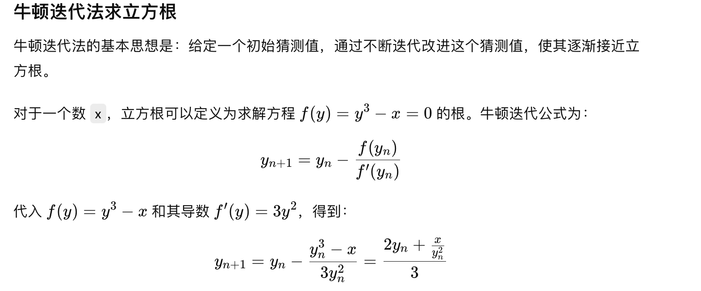
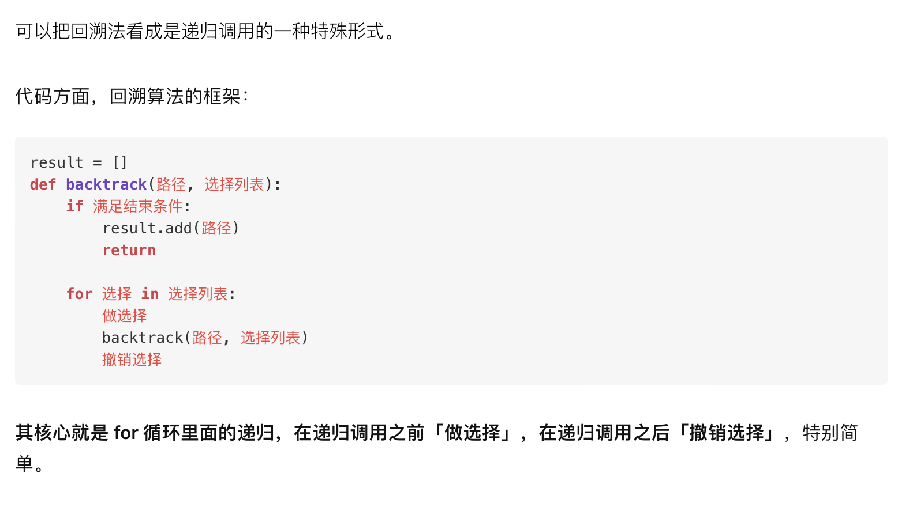

# 牛顿迭代法 求立方根


# 斐波那契求埃及分数

证明b/a （b为真分数，b小于分母a） 可以拆为埃及数的组成 exg：8/11 = 1/2 + 1/5 + 1/55 + 1/110

斐波那契法求解埃及分数的核心是贪心算法。证明这个算法的正确性主要依赖于贪心策略能够确保在每一步都能找到一个单位分数，使得剩余的分数比之前的更小，并且最终会收敛到0。以下是对斐波那契求埃及分数的证明思路：

### 证明斐波那契法求解埃及分数的正确性

#### 1. 算法描述
给定一个真分数 $$\(\frac{a}{b}\)$$ 斐波那契法的步骤如下：
- 每次选择最大的单位分数 \(\frac{1}{x}\)，使得 \(\frac{1}{x} \leq \frac{a}{b}\)。
- 更新剩余的分数为 \(\frac{a}{b} - \frac{1}{x}\)。
- 重复以上步骤，直到剩余分数为零。

#### 2. 证明贪心策略的可行性

##### 贪心选择性质
在每一步中，我们选择最大的单位分数 \(\frac{1}{x}\)，其中 \(x\) 是满足 \(\frac{1}{x} \leq \frac{a}{b}\) 的最小整数，即 \(x = \left\lceil \frac{b}{a} \right\rceil\)。这个选择确保了每一步的更新都会减少剩余分数的大小。

**证明：**  
- 设 \(x = \left\lceil \frac{b}{a} \right\rceil\)，那么 \(\frac{1}{x} \leq \frac{a}{b}\)。
- 更新后的分数为：
  \[
  \frac{a}{b} - \frac{1}{x} = \frac{ax - b}{bx}.
  \]
- 新的分数的分子 \(ax - b\) 小于原来的分子 \(a\)，且新的分数小于 \(\frac{a}{b}\)。 

##### 递归减小
每次选择都会严格减小分子 \(a\)，因此每次操作之后，分数始终在变小。由于分数的分子和分母都是正整数，这个过程不会无限进行，而是会在有限步骤内结束。

#### 3. 正确性证明

##### 收敛性
我们需要证明的是，通过反复执行上述贪心选择的过程，最终会得到一个埃及分数表示，即剩余的分数最终会达到零。

**收敛性论证：**
- 每次减去一个单位分数后，剩余分数的分子 \(ax - b\) 必定小于原分子 \(a\)，同时分母 \(bx\) 增大。由于分子和分母都在发生变化，且总是减少分子，最终 \(\frac{ax - b}{bx}\) 的分子会减到零，从而收敛到零。
- 算法每一步都使分数更接近零，并且不可能出现循环或增加的情况。

#### 4. 终止性
由于每一步分数的分子减少，且总是正整数，当分子减少到0时，算法终止。

### 总结
斐波那契法能够正确求解埃及分数，因为：
- 每一步的贪心选择总是使剩余分数变小。
- 分子的严格递减性和分母的递增性保证了过程的收敛性。
- 有限的减小步骤确保算法终止。

因此，斐波那契求解埃及分数的贪心策略是正确且有效的。

# 1.最大回文字符串

要找出一个字符串中最长的回文子串，可以采用几种不同的方法。最常见的方法包括动态规划、中心扩展算法和Manacher算法。在这里，我将解释中心扩展算法，因为它比较直观且实现起来相对简单。

中心扩展算法的基本思想是：对于给定的字符串，我们可以将每个字符或每对相邻字符视为可能的回文中心，然后向两边扩展，检查以该中心为对称中心的字符串是否为回文。

具体步骤如下：

1. 遍历字符串中的每个字符，将每个字符作为回文中心，向两边扩展，记录并更新最长的回文子串。
2. 同样，遍历字符串中的每对相邻字符，如果它们相同，则将这对字符作为回文中心，向两边扩展，记录并更新最长的回文子串。
3. 比较所有找到的回文子串长度，返回最长的那个。


# 回溯算法

回溯算法，一种通过探索所有可能的候选解来找出所有的解的算法。

它采用试错的思想，它尝试分步的去解决一个问题。在分步解决问题的过程中，当它通过尝试发现现有的分步答案不能得到有效的正确的解答的时候，它将取消上一步甚至是上几步的计算，再通过其它的可能的分步解答再次尝试寻找问题的答案

栈的出栈序列排列问题”或称“卡特兰数问题”：
给定一个数组，该数组中的元素依次入栈。在入栈的过程中，允许在任意时刻进行出栈操作。
问题是：通过这些入栈和出栈操作，最后得到的出栈序列有哪些可能？以及有多少种可能的出栈序列？
使用递归回溯法


# 三数之和，四数之和


# Java 数据结构 树，图，动态规划

## 动态规划

在这里插入图片描述 

之后，豁然开朗 ，感觉动态规划也不是很难，今天，我就来跟大家讲一讲，我是怎么做动态规划的题的，以及从中学到的一些**套路**。相信你看完一定有所收获

如果你对动态规划感兴趣，或者你看的懂动态规划，但却不知道怎么下手，那么我建议你好好看以下，这篇文章的写法，和之前那篇讲递归的写法，是差不多一样的，将会举大量的例子。如果一次性看不完，建议收藏，同时别忘了**素质三连**。

> 为了兼顾初学者，我会从最简单的题讲起，后面会越来越难，最后面还会讲解，该如何优化。因为 80% 的动规都是可以进行优化的。不过我得说，如果你连动态规划是什么都没听过，可能这篇文章你也会压力山大。

#### 一、动态规划的三大步骤

动态规划，无非就是利用**历史记录**，来避免我们的重复计算。而这些**历史记录**，我们得需要一些**变量**来保存，一般是用**一维数组**或者**二维数组**来保存。下面我们先来讲下做动态规划题很重要的三个步骤，

> 如果你听不懂，也没关系，下面会有很多例题讲解，估计你就懂了。之所以不配合例题来讲这些步骤，也是为了怕你们脑袋乱了

**第一步骤**：定义**数组元素的含义**，上面说了，我们会用一个数组，来保存历史数组，假设用一维数组 dp[] 吧。这个时候有一个非常非常重要的点，就是规定你这个数组元素的含义，例如你的 dp[i] 是代表什么意思？

**第二步骤**：找出**数组元素之间的关系式**，我觉得动态规划，还是有一点类似于我们高中学习时的**归纳法**的，当我们要计算 dp[n] 时，是可以利用 dp[n-1]，dp[n-2]…..dp[1]，来推出 dp[n] 的，也就是可以利用**历史数据**来推出新的元素值，所以我们要找出数组元素之间的关系式，例如 dp[n] = dp[n-1] + dp[n-2]，这个就是他们的关系式了。而这一步，也是最难的一步，后面我会讲几种类型的题来说。

> 学过动态规划的可能都经常听到**最优子结构**，把大的问题拆分成小的问题，说时候，最开始的时候，我是对**最优子结构**一梦懵逼的。估计你们也听多了，所以这一次，我将**换一种形式来讲，不再是各种子问题，各种最优子结构**。所以大佬可别喷我再乱讲，因为我说了，这是我自己平时做题的套路。

**第三步骤**：找出**初始值**。学过**数学归纳法**的都知道，虽然我们知道了数组元素之间的关系式，例如 dp[n] = dp[n-1] + dp[n-2]，我们可以通过 dp[n-1] 和 dp[n-2] 来计算 dp[n]，但是，我们得知道初始值啊，例如一直推下去的话，会由 dp[3] = dp[2] + dp[1]。而 dp[2] 和 dp[1] 是不能再分解的了，所以我们必须要能够直接获得 dp[2] 和 dp[1] 的值，而这，就是**所谓的初始值**。

由了**初始值**，并且有了**数组元素之间的关系式**，那么我们就可以得到 dp[n] 的值了，而 dp[n] 的含义是由你来定义的，你想**求什么，就定义它是什么**，这样，这道题也就解出来了。

**不懂？没事，我们来看三四道例题**，我讲严格按这个步骤来给大家讲解。

> 更多算法原创文章，可以关注我的公众号『**苦逼的码农**』

#### 二、案例详解

##### 案例一、简单的一维 DP

> 问题描述：一只青蛙一次可以跳上1级台阶，也可以跳上2级。求该青蛙跳上一个n级的台阶总共有多少种跳法。

###### (1)、定义数组元素的含义

按我上面的步骤说的，首先我们来定义 dp[i] 的含义，我们的问题是要求青蛙跳上 n 级的台阶总共由多少种跳法，那我们就定义 dp[i] 的含义为：**跳上一个 i 级的台阶总共有 dp[i] 种跳法**。这样，如果我们能够算出 dp[n]，不就是我们要求的答案吗？所以第一步定义完成。

###### （2）、找出数组元素间的关系式

我们的目的是要求 dp[n]，动态规划的题，如你们经常听说的那样，就是把一个**规模**比较大的问题分成几个**规模**比较小的问题，然后由小的问题推导出大的问题。也就是说，dp[n] 的规模为 n，比它规模小的是 n-1, n-2, n-3…. 也就是说，dp[n] 一定会和 dp[n-1], dp[n-2]….存在某种关系的。我们要找出他们的关系。

**那么问题来了，怎么找？**

这个怎么找，**是最核心最难的一个**，我们必须回到问题本身来了，来寻找他们的关系式，dp[n] 究竟会等于什么呢？

对于这道题，由于情况可以选择跳一级，也可以选择跳两级，所以青蛙到达第 n 级的台阶有两种方式

一种是从第 n-1 级跳上来

一种是从第 n-2 级跳上来

由于我们是要算**所有可能的跳法的**，所以有 dp[n] = dp[n-1] + dp[n-2]。

###### （3）、找出初始条件

当 n = 1 时，dp[1] = dp[0] + dp[-1]，而我们是数组是不允许下标为负数的，所以对于 dp[1]，我们必须要**直接给出它的数值**，相当于初始值，显然，dp[1] = 1。一样，dp[0] = 0.（因为 0 个台阶，那肯定是 0 种跳法了）。于是得出初始值：

dp[0] = 0.

三个步骤都做出来了，那么我们就来写代码吧，代码会详细注释滴。

```java
int f( int n ){
    if(n <= 1)
    return n;
    // 先创建一个数组来保存历史数据
    int[] dp = new int[n+1];
    // 给出初始值
    dp[0] = 0;
    dp[1] = 1;
    // 通过关系式来计算出 dp[n]
    for(int i = 2; i <= n; i++){
        dp[i] = dp[i-1] + dp[i-2];
    }
    // 把最终结果返回
    return dp[n];
}

```

###### （4）、再说初始化

大家先想以下，你觉得，上面的代码有没有问题？

答是有问题的，还是错的，错在**对初始值的寻找不够严谨**，这也是我故意这样弄的，意在告诉你们，关于**初始值的严谨性**。例如对于上面的题，当 n = 2 时，dp[2] = dp[1] + dp[0] = 1。这显然是错误的，你可以模拟一下，应该是 dp[2] = 2。

也就是说，在寻找初始值的时候，一定要注意不要找漏了，dp[2] 也算是一个初始值，不能通过公式计算得出。有人可能会说，我想不到怎么办？这个很好办，多做几道题就可以了。

> 下面我再列举三道不同的例题，并且，再在未来的文章中，我也会持续按照这个步骤，给大家找几道有难度且类型不同的题。下面这几道例题，不会讲的特性详细哈。实际上 ，上面的一维数组是可以把空间优化成更小的，不过我们现在先不讲优化的事，下面的题也是，不讲优化版本。

##### 案例二：二维数组的 DP

我做了几十道 DP 的算法题，可以说，80% 的题，都是要用二维数组的，所以下面的题主要以二维数组为主，当然有人可能会说，要用一维还是二维，我怎么知道？这个问题不大，接着往下看。

###### 问题描述

一个机器人位于一个 m x n 网格的左上角 （起始点在下图中标记为“Start” ）。

机器人每次只能向下或者向右移动一步。机器人试图达到网格的右下角（在下图中标记为“Finish”）。

问总共有多少条不同的路径？


> 这是 leetcode 的 62 号题：https://leetcode-cn.com/problems/unique-paths/

还是老样子，三个步骤来解决。

###### 步骤一、定义数组元素的含义

由于我们的目的是从左上角到右下角一共有多少种路径，那我们就定义 dp[i] [j]的含义为：**当机器人从左上角走到(i, j) 这个位置时，一共有 dp[i] [j] 种路径**。那么，dp[m-1] [n-1] 就是我们要的答案了。

> 注意，这个网格相当于一个二维数组，数组是从下标为 0 开始算起的，所以 右下角的位置是 (m-1, n - 1)，所以 dp[m-1] [n-1] 就是我们要找的答案。

###### 步骤二：找出关系数组元素间的关系式

想象以下，机器人要怎么样才能到达 (i, j) 这个位置？由于机器人可以向下走或者向右走，所以有两种方式到达

一种是从 (i-1, j) 这个位置走一步到达

一种是从(i, j - 1) 这个位置走一步到达

因为是计算所有可能的步骤，所以是把所有可能走的路径都加起来，所以关系式是 dp[i] [j] = dp[i-1] [j] + dp[i] [j-1]。

###### 步骤三、找出初始值

显然，当 dp[i] [j] 中，如果 i 或者 j 有一个为 0，那么还能使用关系式吗？答是不能的，因为这个时候把 i - 1 或者 j - 1，就变成负数了，数组就会出问题了，所以我们的初始值是计算出所有的 dp[0] [0….n-1] 和所有的 dp[0….m-1] [0]。这个还是非常容易计算的，相当于计算机图中的最上面一行和左边一列。因此初始值如下：

dp[0] [0….n-1] = 1; // 相当于最上面一行，机器人只能一直往左走

dp[0…m-1] [0] = 1; // 相当于最左面一列，机器人只能一直往下走

###### 撸代码

三个步骤都写出来了，直接看代码

```javascript
public static int uniquePaths(int m, int n) {
    if (m <= 0 || n <= 0) {
        return 0;
    }
 
    int[][] dp = new int[m][n]; // 
      // 初始化
      for(int i = 0; i < m; i++){
      dp[i][0] = 1;
    }
      for(int i = 0; i < n; i++){
      dp[0][i] = 1;
    }
        // 推导出 dp[m-1][n-1]
    for (int i = 1; i < m; i++) {
        for (int j = 1; j < n; j++) {
            dp[i][j] = dp[i-1][j] + dp[i][j-1];
        }
    }
    return dp[m-1][n-1];
}
```

> O(n*m) 的空间复杂度可以优化成 O(min(n, m)) 的空间复杂度的，不过这里先不讲。

##### 案例三、二维数组 DP

写到这里，有点累了，，但还是得写下去，所以看的小伙伴，你们可得继续看呀。下面这道题也不难，比上面的难一丢丢，不过也是非常类似

###### 问题描述

给定一个包含非负整数的 *m* x *n* 网格，请找出一条从左上角到右下角的路径，使得路径上的数字总和为最小。

**说明：**每次只能向下或者向右移动一步。

```javascript
举例：
输入:
arr = [
  [1,3,1],
  [1,5,1],
  [4,2,1]
]
输出: 7
解释: 因为路径 1→3→1→1→1 的总和最小。

```

和上面的差不多，不过是算最优路径和，这是 leetcode 的第64题：https://leetcode-cn.com/problems/minimum-path-sum/

> 还是老样子，可能有些人都看烦了，哈哈，但我还是要按照步骤来写，让那些不大懂的加深理解。有人可能觉得，这些题太简单了吧，别慌，小白先入门，这些属于 medium 级别的，后面在给几道 hard 级别的。

###### 步骤一、定义数组元素的含义

由于我们的目的是从左上角到右下角，最小路径和是多少，那我们就定义 dp[i] [j]的含义为：**当机器人从左上角走到(i, j) 这个位置时，最下的路径和是 dp[i] [j]**。那么，dp[m-1] [n-1] 就是我们要的答案了。

> 注意，这个网格相当于一个二维数组，数组是从下标为 0 开始算起的，所以 由下角的位置是 (m-1, n - 1)，所以 dp[m-1] [n-1] 就是我们要走的答案。

###### 步骤二：找出关系数组元素间的关系式

想象以下，机器人要怎么样才能到达 (i, j) 这个位置？由于机器人可以向下走或者向右走，所以有两种方式到达

一种是从 (i-1, j) 这个位置走一步到达

一种是从(i, j - 1) 这个位置走一步到达

不过这次不是计算所有可能路径，而是**计算哪一个路径和是最小的**，那么我们要从这两种方式中，选择一种，使得dp[i] [j] 的值是最小的，显然有

```javascript
dp[i] [j] = min(dp[i-1][j]，dp[i][j-1]) + arr[i][j];// arr[i][j] 表示网格种的值
```

###### 步骤三、找出初始值

显然，当 dp[i] [j] 中，如果 i 或者 j 有一个为 0，那么还能使用关系式吗？答是不能的，因为这个时候把 i - 1 或者 j - 1，就变成负数了，数组就会出问题了，所以我们的初始值是计算出所有的 dp[0] [0….n-1] 和所有的 dp[0….m-1] [0]。这个还是非常容易计算的，相当于计算机图中的最上面一行和左边一列。因此初始值如下：

dp[0] [j] = arr[0] [j] + dp[0] [j-1]; // 相当于最上面一行，机器人只能一直往左走

dp[i] [0] = arr[i] [0] + dp[i] [0];  // 相当于最左面一列，机器人只能一直往下走

###### 代码如下

```javascript
public static int uniquePaths(int[][] arr) {
      int m = arr.length;
      int n = arr[0].length;
    if (m <= 0 || n <= 0) {
        return 0;
    }
 
    int[][] dp = new int[m][n]; // 
      // 初始化
      dp[0][0] = arr[0][0];
      // 初始化最左边的列
      for(int i = 1; i < m; i++){
      dp[i][0] = dp[i-1][0] + arr[i][0];
    }
      // 初始化最上边的行
      for(int i = 1; i < n; i++){
      dp[0][i] = dp[0][i-1] + arr[0][i];
    }
        // 推导出 dp[m-1][n-1]
    for (int i = 1; i < m; i++) {
        for (int j = 1; j < n; j++) {
            dp[i][j] = Math.min(dp[i-1][j], dp[i][j-1]) + arr[i][j];
        }
    }
    return dp[m-1][n-1];
}

```

> O(n*m) 的空间复杂度可以优化成 O(min(n, m)) 的空间复杂度的，不过这里先不讲。更多原创算法文章，可以关注我的公众号『苦逼的码农』

##### 案例 4：编辑距离

这次给的这道题比上面的难一些，在 leetcdoe 的定位是 hard 级别。好像是 leetcode 的第 72 号题。

**问题描述**

给定两个单词 word1 和 word2，计算出将 word1 转换成 word2 所使用的最少操作数 。

你可以对一个单词进行如下三种操作：

插入一个字符

```javascript
示例 1:
输入: word1 = "horse", word2 = "ros"
输出: 3
解释: 
horse -> rorse (将 'h' 替换为 'r')
rorse -> rose (删除 'r')
rose -> ros (删除 'e')

```

**解答**

还是老样子，按照上面三个步骤来，并且我这里可以告诉你，90% 的字符串问题都可以用动态规划解决，并且90%是采用二维数组。

###### 步骤一、定义数组元素的含义

由于我们的目的求将 word1 转换成 word2 所使用的最少操作数 。那我们就定义 dp[i] [j]的含义为：**当字符串 word1 的长度为 i，字符串 word2 的长度为 j 时，将 word1 转化为 word2 所使用的最少操作次数为 dp[i] [j]**。

> 有时候，数组的含义并不容易找，所以还是那句话，我给你们一个套路，剩下的还得看你们去领悟。

###### 步骤二：找出关系数组元素间的关系式

接下来我们就要找 dp[i] [j] 元素之间的关系了，比起其他题，这道题相对比较难找一点，但是，不管多难找，大部分情况下，dp[i] [j] 和 dp[i-1] [j]、dp[i] [j-1]、dp[i-1] [j-1] 肯定存在某种关系。因为我们的目标就是，**从规模小的，通过一些操作，推导出规模大的**。对于这道题，我们可以对 word1 进行三种操作

插入一个字符

由于我们是要让操作的次数最小，所以我们要寻找最佳操作。那么有如下关系式：

一、如果我们 word1[i] 与 word2 [j] 相等，这个时候不需要进行任何操作，显然有 dp[i] [j] = dp[i-1] [j-1]。（别忘了 dp[i] [j] 的含义哈）。

二、如果我们 word1[i] 与 word2 [j] 不相等，这个时候我们就必须进行调整，而调整的操作有 3 种，我们要选择一种。三种操作对应的关系试如下（注意字符串与字符的区别）：

（1）、如果把字符 word1[i] 替换成与 word2[j] 相等，则有 dp[i] [j] = dp[i-1] [j-1] + 1;

（2）、如果在字符串 word1末尾插入一个与 word2[j] 相等的字符，则有 dp[i] [j] = dp[i] [j-1] + 1;

（3）、如果把字符 word1[i] 删除，则有 dp[i] [j] = dp[i-1] [j] + 1;

那么我们应该选择一种操作，使得 dp[i] [j] 的值最小，显然有

**dp[i] [j] = min(dp[i-1] [j-1]，dp[i] [j-1]，dp[[i-1] [j]]) + 1;**

于是，我们的关系式就推出来了，

###### 步骤三、找出初始值

显然，当 dp[i] [j] 中，如果 i 或者 j 有一个为 0，那么还能使用关系式吗？答是不能的，因为这个时候把 i - 1 或者 j - 1，就变成负数了，数组就会出问题了，所以我们的初始值是计算出所有的 dp[0] [0….n] 和所有的 dp[0….m] [0]。这个还是非常容易计算的，因为当有一个字符串的长度为 0 时，转化为另外一个字符串，那就只能一直进行插入或者删除操作了。

###### 代码如下（可以左右滑动）

```javascript
public int minDistance(String word1, String word2) {
    int n1 = word1.length();
    int n2 = word2.length();
    int[][] dp = new int[n1 + 1][n2 + 1];
    // dp[0][0...n2]的初始值
    for (int j = 1; j <= n2; j++) 
        dp[0][j] = dp[0][j - 1] + 1;
    // dp[0...n1][0] 的初始值
    for (int i = 1; i <= n1; i++) dp[i][0] = dp[i - 1][0] + 1;
        // 通过公式推出 dp[n1][n2]
    for (int i = 1; i <= n1; i++) {
        for (int j = 1; j <= n2; j++) {
              // 如果 word1[i] 与 word2[j] 相等。第 i 个字符对应下标是 i-1
            if (word1.charAt(i - 1) == word2.charAt(j - 1)){
                p[i][j] = dp[i - 1][j - 1];
            }else {
               dp[i][j] = Math.min(Math.min(dp[i - 1][j - 1], dp[i][j - 1]), dp[i - 1][j]) + 1;
            }         
        }
    }
    return dp[n1][n2];  
}

```

最后说下，如果你要练习，可以去 leetcode，选择动态规划专题，然后连续刷几十道，保证你以后再也不怕动态规划了。当然，遇到很难的，咱还是得挂。

### 打劫问题

大家如果刚接触这样的题目，会有点困惑，当前的状态我是偷还是不偷呢？

仔细一想，当前房屋偷与不偷取决于 前一个房屋和前两个房屋是否被偷了。

所以这里就更感觉到，当前状态和前面状态会有一种依赖关系，那么这种依赖关系都是动规的递推公式。

当然以上是大概思路，打家劫舍是dp解决的经典问题，接下来我们来动规五部曲分析如下：

1. 确定dp数组（dp table）以及下标的含义

**dp[i]：考虑下标i（包括i）以内的房屋，最多可以偷窃的金额为dp[i]**。

1. 确定递推公式

决定dp[i]的因素就是第i房间偷还是不偷。

如果偷第i房间，那么dp[i] = dp[i - 2] + nums[i] ，即：第i-1房一定是不考虑的，找出 下标i-2（包括i-2）以内的房屋，最多可以偷窃的金额为dp[i-2] 加上第i房间偷到的钱。

如果不偷第i房间，那么dp[i] = dp[i - 1]，即考 虑i-1房，（**注意这里是考虑，并不是一定要偷i-1房，这是很多同学容易混淆的点**）

然后dp[i]取最大值，即dp[i] = max(dp[i - 2] + nums[i], dp[i - 1]);

1. dp数组如何初始化

从递推公式dp[i] = max(dp[i - 2] + nums[i], dp[i - 1]);可以看出，递推公式的基础就是dp[0] 和 dp[1]

从dp[i]的定义上来讲，dp[0] 一定是 nums[0]，dp[1]就是nums[0]和nums[1]的最大值即：dp[1] = max(nums[0], nums[1]);