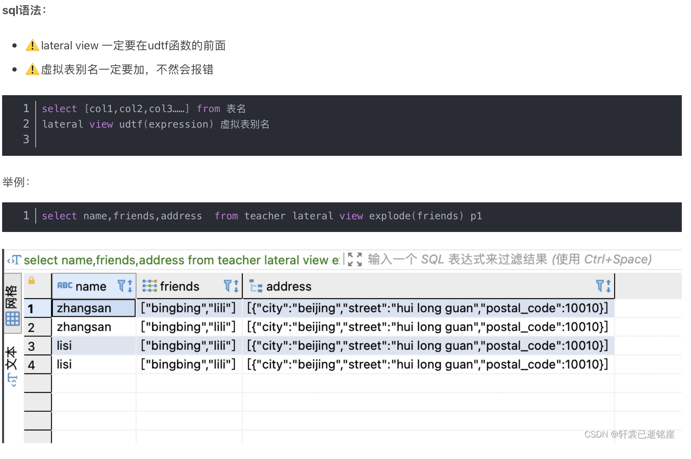
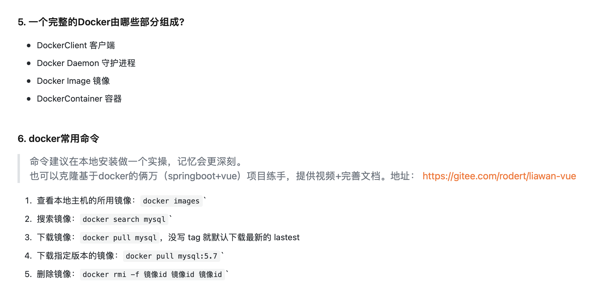

# 自我介绍
在技术方面，我熟悉包括Hadoop、Spark和Hive在内的大数据技术栈，同时也具有扎实的SQL数据库操作能力。我参与过多个项目，其中包括数据分析项目和一个我基于个人创意优化的Spark NLP项目....
# 根据简历上 问问题!!!

## hive笔记冲刺
*课件*  
<embed src="/Hive_resume.pdf" type="application/pdf" width="100%" height="600px" />
<div style="text-align: center">*以上资源来自网上共享，如有侵权请联系我删除*</div>  

## 1. 介绍一下hadoop

Hadoop是一个开源框架，由Apache 开发，用于存储和处理大规模数据集。它的核心是Hadoop分布式文件系统（HDFS），它提供了高吞吐量的数据访问，能够将数据存储在廉价的、标准的硬件上。Hadoop的另一个重要组成部分是MapReduce编程模型，它支持并行计算，让我们可以对存储在HDFS中的数据进行分析和处理。Hadoop被广泛应用于数据挖掘、日志处理、数据仓库、市场分析等多种场景。

## 1.1 hadoop 常见压缩技术

bzip2, gzip, Lzo,snappy,

## 2.介绍一下mapreduce

MapReduce是一种计算引擎，它将大规模数据处理作业分为两个阶段：Map阶段和Reduce阶段。在Map阶段，大数据集被分成小数据块，并对每个块进行并行处理。Map的任务是处理输入数据（通常是键值对），生成一组中间键值对。接下来可能会有combine阶段 对map端局部聚合，但是要遵循密等性

- 数据首先被存储在 Hadoop 分布式文件系统（HDFS）中。HDFS 将大型文件自动分割成大小通常为 128 MB 或 256 MB 的数据块（block）。
- 这些数据块被存储在集群的多个节点上，每个数据块通常有多个副本，以提高数据的可靠性和可用性。

shuffle 阶段 Shuffle 过程的步骤

分为map shuffle 

分区partition

②写入环形内存缓冲区

③执行溢出写

​    排序sort--->合并combiner--->生成溢出写文件

④归并merge

因为频繁的磁盘I/O操作会严重的降低效率，因此“中间结果”不会立马写入磁盘，而是优先存储到map节点的“环形内存缓冲区”，在写入的过程中进行分区（partition），也就是对于每个键值对来说，都增加了一个partition属性值，然后连同键值对一起序列化成字节数组写入到缓冲区（缓冲区采用的就是字节数组，默认大小为100M）。当写入的数据量达到预先设置的阙值后（mapreduce.map.io.sort.spill.percent,默认0.80，或者80%）便会启动溢写出线程将缓冲区中的那部分数据溢出写（spill）到磁盘的临时文件中，并在写入前根据key进行排序（sort）和合并（combine，可选操作）。溢出写过程按轮询方式将缓冲区中的内容写到mapreduce.cluster.local.dir属性指定的目录中。当整个map任务完成溢出写后，会对磁盘中这个map任务产生的所有临时文件（spill文件）进行归并（merge）操作生成最终的正式输出文件，此时的归并是将所有spill文件中的相同partition合并到一起，并对各个partition中的数据再进行一次排序（sort），生成key和对应的value-list，文件归并时，如果溢写文件数量超过参数min.num.spills.for.combine的值（默认为3）时，可以再次进行合并。至此，map端shuffle过程结束，接下来等待reduce task来拉取数据。对于reduce端的shuffle过程来说，reduce task在执行之前的工作就是不断地拉取当前job里每个map task的最终结果，然后对从不同地方拉取过来的数据不断地做merge最后合并成一个分区相同的大文件，然后对这个文件中的键值对按照key进行sort排序，排好序之后紧接着进行分组，分组完成后才将整个文件交给reduce task处理。
纠正：分区好像是发生在溢出写过程之前，也就是当满足溢出写条件时，首先进行分区，然后分区内排序，并且选择性的combine，最后写出到磁盘。
shuffle 图解

- 

在Reduce阶段 http协议 获取该reduce对应分区号来自不同的map task文件 归并排序 操作如同map  写内存 内存不够 再磁盘，

所有Map任务输出的中间数据被收集和排序（按键排序），然后按键分组，以便每个唯一键的所有对应值都传递到一个Reducer。Reducer然后处理这些值，并输出最终结果。


## 3.hive 介绍 和mapreduce联系

Hive是建立在Hadoop之上的一个**数据仓库工具**，它提供了一种**类SQL**语言（HiveQL）来查询数据。用来处理海量日志结构化的数据，
内部查询—>**MapReduce、Tez或Spark计算引擎**。
Hive非常适合那些需要查询和分析的场景
Hive 存储在**HDFS** ->文件映射成表。
或其他数据存储系统如Apache **HBase(列式存储，条件查询列查询效率更高)中的数据**，
并且它也支持各种压缩数据格式，包括文本文件、**Parquet和ORC**等
执行程序提交给yarn

### 数据压缩格式


hive在mapreduce上怎么执行的？driver 驱动上
1.（解析）抽象语法树（AST）
 2.（编译）将AST-》逻辑执行计划，表连接、选择、聚合等操作。
3.(优化)， 优化操作化策略可能包括合并操作、选择最佳的连接策略（如Map端连接或Reduce端连接）
4.（执行）mapreduce map阶段 筛选转换操作 键值对  5.reduce阶段 按键排序 聚集数据 聚合

## 3.1 hive中的文件存储格式

textfile  rcfile(行分块列存储) orcfile 行分块列存储 使用索引 速度快压缩效率高
parquet 列存储 压缩比orcfile低
sequence 二进制存储 key，value
压缩比 orc>parquet>textfile

## 3.2 hive和hbase区别 暂时不用

一个是依赖hadoop 生态数仓工具 类sql语句查询  数仓分析工具 
一个是分布式 列存储的nosql数据库，高扩展高可用 低延迟 实时分析


## 3.3 hive 优缺点

优点

1）操作接口采用类SQL语法，提供快速开发的能力（简单、容易上手）。

2）避免了去写MapReduce， 减少开发人员的学习成本。

3）自定义函数？炸裂函数？array转换成多行，Java编写自定义函数

缺点：效率低，即使数据量很少也要走mapreduce 提交job等工作，运行时间长


炸裂函数




## 3.4 hive 内部表和外部表区别

1）内部表数据由Hive自身管理，外部表数据由HDFS管理； 外部表删除只删除元数据 数据不会删除

2） 内部表数据存储的位置是hive.metastore warehouse.dir（默认：/user/hive/warehouse），外部表数据的存储位置由自己制定（如果没有LOCATION， Hive将在HDFS 上的/user/hive/warehouse文件夹下以外部表的表名创建一个文件夹，并将属于这个表的数据存放在这里）；

3）删除内部表会直接删除元数据 （metadata）及存储数据；删除外部表仅仅会删除元数据，HDFS上的文件并不会被删除；

4)对内部表的修改会将修改直接同步给元数据，而对外部表的表结构和分区进行修改，则需要修复 (MSCK REPAIR TABLE table_name;) .


## 3.5 hive数据倾斜 ！！！！！！！！！！！！

主要特点就是 reduce端几个节点运行压力过大，大部分节点已经完成，都在等那几个还在运行的，处理时间很长，最主要的原因就是reduce端的key 不均衡，某几个的key数量显著大于其他key， （join，groupby等根据key来reduce的操作，还有就是count（distinct）特殊值很多） 

现象: •任务进度长时间维持在99%（或100%），查看任务监控页面，发现只有少量（1个或几个）reduce 子任务未完成。因为其处理的数据量和其他reduce差异过大。

导致的原因是：key分布不均匀，sql语句本身的数据倾斜，数据本身的问题

解决方法：
map端局部聚合 hive.map.aggr = true
Hive.groupby.skewindata = true   -》 两个mr，第一个mr 对key 进行随机分组到reduce   局部聚合（相同key 会被分配到不同reduce中） 负载均衡， 第二个mr 正常执行，减少key对应的value数量

sql条件：
大小表join   小表（<1000 row）先进内存，然后不断读大表 直接在map端完成reduce功能 直接不走reduce了(mapjoin)

大表join 大表，直接给key 打随机前缀标签，使他们均匀分布 然后在reduce结束后 去掉前缀即可,  i使用 smbjoin 分桶hash

Sum group by 代替count（distinct），count（distinct） 已经在reduce 端进行计算，对于维度小的 直接采取map端计算更好

对于大量空值的key  直接对空值加随机数，左连接，将其均匀分布在reduce端 减少数据倾斜的可能

适当调整 reduce 个数

cluster by 就是 distribute by + sort by 分区排序 在 reduce前 排序

## 3.6hive 分区和分桶的区别

分区就是根据指定分区列值 在对应的文件目录下 新建一个该列值的子目录
分桶则是在表或者分区表的基础上 使用hash 除以桶的个数 分桶

## 3.7 hive 具体执行过程 


hivesql 如何转换成mapreduce的


连表key 作为 map端的输出key｜ 主要还是一个原则 看连表的key groupby 的列，根据他们进行map端key的选择，有多个的话 map key对应肯定也要多个，如果出现join + groupby 的情况 一般要用两个mp进行

## 3.8 小文件问题

reduce 设置过多， 文件本身量多但不大，
解决方法
map前 合并小文件 设置合适的reduce，随机分配给不同的reduce，中间结果压缩， 自带归档技术
sequence file  kv 存储 

## 3.9 hive 窗口函数 olap 在线分析

聚合函数（累计购买次数）一般都有窗户函数功能，排序函数（连续登陆天数）结合orderby 强制指定列 对于lead lag row_number 强制，如果没有order by 没有意义
partition by 指定分区 聚合之类的操作
rows  betweens --- and ——————  10  preceding and unbounded following /  current now / unbounded preceding/ 7 following 

留存率 left join datediff  left join， 直接把指定天数的留存人数全算出来，然后除以count总数


## 4.sql逻辑执行顺序

from （on join） where groupby(可以读取select中重命名的列 物理顺序) having  select order by limit


## 5.介绍一下hash 

Hash（哈希）是一种广泛使用的数据处理技术，主要用于快速数据查找、数据加密和数据校验等多种应用。哈希函数将输入（通常称为“键”）转换成一个固定大小的数值，这个数值称为哈希值或哈希码。理想的哈希函数具有几个关键特性：

1. **效率**：哈希函数应该能够快速地计算出哈希值。

2. **确定性**：相同的输入总是产生相同的哈希值。

3. **均匀分布**：哈希函数应该将输入均匀地映射到哈希表中，以减少冲突。

4. **最小化冲突**：不同的输入值尽可能产生不同的哈希值。
   boolom过滤器 查重（(多个)hash函数->位数组），count-min sketch 验证估算出现多少次 二维数组每个hash函数维护一个数组，遍历的时候 在每个hash函数映射对应的数值上累加，最后对比多个hash函数的数组选最小的。
   以上都有可能误判，可以增加hash函数 数组长度等， 有一些优化公式

   

### 哈希的应用领域

**数据存储**：哈希表是一种基于哈希函数的数据结构，它提供了非常快的平均时间复杂度为O(1)的插入、删除和查找操作。例如，在Python中的字典（`dict`）和集合（`set`）就是基于哈希表实现的。

**数据查重**：在处理大量数据时，哈希技术可以高效地检测和处理重复数据。例如，在大数据处理中，可以通过计算数据的哈希值来快速比较数据是否重复。

## 5.spark 运行机制


## 5.1 spark rdd作用

1.spark 最基本的抽象存储单元，可分区 只读的数据，分布在集群中的多台计算机上 能够并行操作
rdd 将数据集分布 分成多个分区 每个分区都在不同节点上 提高并行计算
2 血缘机制，某个分区的数据丢失 根据血缘关系 找到父rdd的分区 重新计算 对于窄依赖 没有冗余计算 对于宽依赖 有冗余计算
3.惰性计算，先构建dag 图， 如果调用action 才会触发计算
4.只读性，一旦创建不能被修改 若要转换 需要新建一个rdd

## 5.2 spark 宽依赖和窄依赖 

窄依赖： 父rdd的分区 最多只能被一个 子rdd一个分区使用
宽依赖： 相当于shuffle  多个子rdd 可能依赖多一个父rdd

窄依赖：一个父RDD的分区对应一个子RDD的分区，或者多个父RDD的分区对应一个子RDD的分区。典型操作包括map/filter/union等，不会包含Shuffle操作
宽依赖：一个父RDD的一个分区对应一个子RDD的多个分区。典型操作包括groupByKey/sortByKey等，通常包含Shuffle操作

## 5.3 spark 的资源管理

本地模式，mesos 和 yarn模式

yarn模式 -》 resourse manager -》 node manager -〉container -》 application master 
application 申请资源向resource  通知其他node manager 启动exector ，exector 向node manager application master 汇报任务
Spark 可以将一系列的操作组合成一个任务流水线，避免了多余的数据存储和读取操作，提高了计算效率。

## 5.4 spark join

broadcast hash join  
broadcast 将小表广播到大表所在的所有节点内存上，跟大表进行hash join操作

shuffle hash join。利用集群资源 shuffle 原理 相同的join key 会在同一个节点上 两张表的数据会被重分布到集群中所有节点
然后还是每个节点进行hash join 操作

sort merge  join， shuffle 重新分区 -》 sort 对单个分区节点的两表数据排序， merge阶段 同时遍历两表 join操作 遇到相同的 输出


## 5.5 spark shuffle 


跟mapreduce shuffle区别是。mapreduce shuffle 都是最终是全局排序的，
但是spark shuffle 可以控制 是否排序 是否聚合

1. 功能上，MR的shuffle和Spark的shuffle是没啥区别的，都是对Map端的数据进行分区，要么聚合排序，要么不聚合排序，然后Reduce端或者下一个调度阶段进行拉取数据，完成map端到reduce端的数据传输功能。
2. 方案上，有很大的区别，MR的shuffle是基于合并排序的思想，在数据进入reduce端之前，都会进行sort，为了方便后续的reduce端的全局排序，而Spark的shuffle是可选择的聚合，特别是1.2之后，需要通过调用特定的算子才会触发排序聚合的功能。
3. 流程上，MR的Map端和Reduce区分非常明显，两块涉及到操作也是各司其职，而Spark的RDD是内存级的数据转换，不落盘，所以没有明确的划分，只是区分不同的调度阶段，不同的算子模型。
4. 数据拉取，MR的reduce是直接拉去Map端的分区数据，而Spark是根据索引读取，而且是在action触发的时候才会拉去数据。
5. HashShuffle，虽然MR和shuffle读都会进行HashShuffle，但是如果在shuffle读没有combine操作的时候同时分区数少于设定的阈值，则不会在HashMap的时候预先对分区中所有的健值对进行merge和sort，从而省下了排序过程。

## 5.6 spark 数据倾斜问题


## 5.7 spark 容错机制


## 6. mapreduce 和 spark 有什么区别

1. 相较于mr, spark 更快 内存运算更快 磁盘运算也更快，其实现了dag 有向无环图的计算引擎，提供了丰富的api 做一些数据变换更灵活的操作， 还可以流式处理， 机器学习 和图计算  兼容性高。

2. 为什么spark 更快。spark 数据存储在内存中 不到迫不得已不会使用磁盘

   减少像mapreduce shuflle 过程 重复磁盘io 的消耗
   spark 可以将一系列的操作组合成一个任务流水线，避免了多余的数据存储和读取操作，提高了计算效率。
   更高效的任务调度器
   数据复用 不需要每次读取都像mapreduce一样 重复加载数据，rdd的惰性使他可以在后续的多次transformation中 重复利用

- 在mr过程中会重复的读写hdfs，造成大量的io操作，多个job需要自己管理关系。

## 7.拉链表设计

场景： 数据量比较大，但是每日更新的数据比较少，比起每日全量快照，拉链表减少冗余， 拉链表还可以反映历史数据变化
日期 初始日期 结束日期=永久日期 每天对比初始日期是否发生变化 如果发生变化则更新结束日期 
如何实现拉链表
既然理解了什么是拉链表，那么应该如何实现呢？

方式一

（1）获取当日数据；

（2）比较当日数据及历史数据，找出新增和变化的数据，存到临时表，并将开始日期置为当前日期，结束日期置为最大日期；

（3）将历史数据表中的变化数据的结束日期更新为当前日期，即闭链；

（4）将临时表的新增和变化数据插入历史数据表中，即开链。


## 8.举例说明事务事实表，周期快照事实表

#### 事务事实表

**事务事实表**记录了事务性业务事件的细节，每当业务事件发生时，就会向事务事实表中插入一条记录。这类事实表非常详细，通常包含日期、时间、参与事务的维度的键、度量值（如金额、数量等）。

#### 周期快照事实表

**周期快照事实表**则记录了在固定时间周期（如每日、每周、每月）结束时的累积度量。这种事实表适合于追踪随时间累积的数据，如月底的库存数量、每周的销售总额等

## 9.衡量数仓的数据质量，有哪些指标


## 9.1数仓各层作用


## 10. rpc 和 rest 区别

1. **RPC（远程过程调用）**：
   - RPC 是一种通信模式，允许一个计算机程序调用另一个地址空间（通常是另一台机器上）的子程序。
   - RPC 的设计思想是使远程服务调用像本地调用一样简单，开发者不需要关心底层的网络通信细节。
   - RPC 的调用方式可以是同步的或者异步的，底层实现通常是通过网络传输消息，比如使用基于 TCP 或 UDP 的通信协议。
2. **REST（表述性状态转移）**：
   - REST 是一种面向资源的软件架构风格，强调使用统一的接口对资源进行操作。
   - REST 基于 HTTP 协议，使用 HTTP 的标准方法（如 GET、POST、PUT、DELETE）对资源进行 CRUD（创建、读取、更新、删除）操作。
   - REST 风格的 API 通常使用 URL 表示资源，通过 HTTP 动词表示对资源的操作，而且支持状态转移和无状态通信。

## 11. docker 面试

Docker 是可简化创建、管理、运行和分发应用程序。它使用容器来打包应用程序及其依赖项。我们也可以将容器视为 Docker 镜像的运行时实例。



## 12.项目介绍 

### python 标准库 有哪些？ os，sys，json，logging，re，collections，pickle 序列化

### 项目背景 根据各大金融新闻网站的新闻头条 分析当前市场的情感趋向（积极，中立，消极），间接反应市场变化 进行情绪监控 投资决策

## 12.1 爬虫介绍，自动化部署（数据量过大，增加kafka分区 减少单节点存储压力）

爬取的网站数据量有多少？ 大概可能有1000条-10000条 ，反爬策略可能已经把我的ip 封掉了  在爬虫脚本中 对数据清洗完全文本的格式，然后调用python-kafka 直接推送到 kafka 的 topic 主题 (  )，主题如何划分（主要按照新闻来源划分，路透社，华尔街日报等）
（有考虑到根据内容划分，可以根据关键词划分）

sparkstreaming 使用readstream kafka 的流，进行数据预处理，大小写转换 分词，去标点符号，

使用hugging face 的 提高的transformer distill 微调模型进行训练，提前训练好的nlp模型，已经存储到本地文件系统（分布式可以存储到hdfs）中 model.save_pretrained(f"./{model_name2}") tokenizer.save_pretrained(f"./{model_name2}")
单节点没有考虑性能问题， 多节点我觉得可以使用广播变量，优化模型加载，避免每个节点单独加载模型

爬虫可能失效了，现在使用的是人工测试 从sparkstreaming 读取指定本地文件系统进行测试

最后将结果DataFrame.write输出到clickhouse 列式存储数据库 考虑后期数据大
sql查询时只需要指定的列 可大大提升查询速度

#### distillbert 模型 特征如何提取的？

特征缩放，使用了一个umap算法 大致就是计算变量之间的相似度 使用cos距离公式
**Self-Attention Mechanism**：DistilBERT使用自注意力机制来处理输入。自注意力允许模型在处理每个词时考虑到句子中的所有其他词，这是通过计算注意力分数来实现的，

#### logistic 回归，根据得到的x 和 标签y 进行logistic分类预测


### 项目不足

1.爬虫数据源信息 不稳定，数据获取可能不合规 法律， 数据质量不是很好，存在噪声
（目前已改成异步请求kpi 提升获取数据速率 保证数据规范性）
2.kafka 未能真正做到 削峰处理，数据量不够，显示不出他的效果 只是理论层上的
3.分布式系统没有考虑
4.未来可以使用llm 嵌入

**自训练机制**：可以是人为干预也可以是自动化。一种方法是使用Spark MLlib或其他库进行在线学习，其中模型定期或根据特定触发条件更新。自动化后台训练通常涉及设置评估指标和阈值，当模型性能低于阈值时自动触发训练流程。
5。未来项目发展 打算使用时间序列 把每日的情感变化显示出来，根据情感变化曲线结合相关股市的关键字 能否预测出当前股民对股市的情感态度


----------------------------------------------------------------------------------------------------------------------------------------------------------

## 13.zookeeper 介绍

zooKeeper是一个**分布式的，开放源码的分布式**应用程序协调服，它是**集群的管理者，监视着集群中各个节点的状态根据节点提交的反馈进行下一步合理操作。简单易用的接口和性能高效、功能稳定的系统提供给用户。 客户端的读请求可以被集群中的**任意一台机器处理，如果读请求在节点上注册了监听器，对于**写请求，请求同时发给其他zookeeper机器并且达成一致后才请求成功**
zookeeper的集群机器增多，读请求的吞吐会提高但是写请求的吞吐会下降

## 13.1 zk 工作原理

Zookeeper 的核心是**原子广播，这个机制保证了**各个Server之间的同步。实现这个机制的协议叫做**Zab协议。Zab协议有两种模式，它们分别是**恢复模式（选主）和**广播模式（同步）。当服务启动或者在领导者崩溃后，Zab就进入了恢复模式，当领导者被选举出来，且大多数Server完成了和 leader的状态同步以后，恢复模式就结束了。状态同步保证了leader和Server具有相同的系统状态


## 14. apache Kafka 介绍

1.scala 编写  分布式 分区多副本  多订阅者(消息持久化 历史记录，消费后不会被删除) 日志系统

2.离线和在线消费  消息存储在磁盘上 防止数据消失 
他与apache spark 有很好的集成，用于实时流式数据分析

好处 可扩展 可靠 耐用

### 结构

生产者推送流到一个或多个topic主题  --》 broker
消费者可以订阅一个或多个topic 主题 （broker）并处理这些主题的流 
broker  代表一个kafka节点 一个服务器

**之前版本 kafka主要依靠zookeeper** 操作元数据  zookeeper -》 协调代理 role，生产者push数据时  处理brokerid，在消费者pull数据时 更新偏移量 
现在kafka 有自己的一套东西 kraft  有自己的控制器quorum 

### 分区

*：分区数越多，同一时间可以有越多的消费者来进行消费，消费数据的速度就会越快，提高消费的性能*


### Cap 原则


### 应用场景

1. 日志聚合 处理好格式 给多个服务器
2. 流式处理， 给一些流式计算框架消费 spark stream，flink， storm 等


# 1.数仓建模


# 

选择业务过程：由于我们公司当时数据量较小，我把javeEE 涉及的业务表全部导入了，这些表包括实体表，维度表，事务型快照事实表，周期性快照事实表、累积型事实表。过来之后，将这些表作为矩阵的一个列。

 声明粒度：粒度一般有：一行信息代表一次、按天、按周、按月等，参考了很多架构之后，我们考虑到后期想要分析更多的指标，只能选择最小的粒度，一行信息代表一次消费。 

确认维度：采用标准数仓建模的思维，争取事实表周围都是1 级维度。我们关系的就是什么时间、什么地点、什么人、具体什么活动、优惠券等主题的维度，同时将跟用户、商品相关的表进行维度退化，尽量把他们降成一级维度。 

确认事实：这里我们确定的不是事实表，而是事实表的度量值，我们用到的度量值有订单的个数、订单的金额、下单次数等可以累加的字段。

*。**DWS 层最大的行为宽表是用户行为宽表**，其字段有互*

*动日期、用户id、用户昵称、注册日期、注册来源、细分渠道、注册省*

*份、评论次数、打赏次数、添加收藏、取消收藏、关注商品、取消关注的*

*商品、关注人、取消关注的人、点不值次数、点值次数、点赞次数、分享*

*次数、爆料数、加购物车数、取消购物车次数等待*!

# 

## 指标问题


# 2. Mysql 存储引擎


### **2、索引的分类有哪些？**

（1）按数据结构分类：B+Tree 索引、HASH 索引、Full-Text 索引。

（2）按「物理存储」分类：聚簇索引（主键索引）、二级索引（辅助索引）。

主键索引的 B+Tree 的叶子节点存放的是实际数据，所有完整的用户记录都存放在主键索引的 B+Tree 的叶子节点里；
二级索引的 B+Tree 的叶子节点存放的是主键值，而不是实际数据。
聚簇索引字段选择：
01.如果有主键，默认会使用主键作为聚簇索引的索引键（key）；
02.如果没有主键，就选择第一个不包含 NULL 值的唯一列作为聚簇索引的索引键（key）；
03.在上面两个都没有的情况下，InnoDB 将自动生成一个隐式自增 id 列作为聚簇索引的索引键（key）；

# 2.索引优化

## MySQL常见索引

**每一个索引都是建立在一个列上的，一个数据表中可以为多个列声明索引**。在MySQL数据库中，常用的索引根据用途和作用效果可以被分为以下几类：

### 1. 普通索引

普通索引是MySQL中最基本索引类型，基本上对列的数据不会加任何的限制，可以允许空值和重复值，最主要的用途就是加快数据的访问速度。

### 2. 唯一索引

唯一索引指的是对数据添加了唯一性约束，这一列的数据当中不能够出现重复的值，但是可以有null值（至多有一个）。在创建唯一索引时会进行数据校验，如果此时已经有了重复数据，则索引创建失败。在建立唯一索引后，再向表中插入已有的重复数据时，也会被拒绝。

### 3. 主键索引

主键索引的特点是：非空、唯一。所以如果我们想找一列作为每条数据的唯一标识，就会将这一列声明为主键。由于主键的特点，经常会被作为**其他表外键的参照列**，也是在进行**数据同步时的主要参照**。

### 4. **组合索引**：

### 在表中的多个字段组合上创建的索引，只有在查询条件中使用了这些字段的左边字段时，索引才会被使用，使用组合索引时遵循最左前缀集合。例如，这里由id、name和age3个字段构成的索引，索引行中就按id/name/age的顺序存放，索引可以索引下面字段组合(id，name，age)、(id，name)或者(id)。如果要查询的字段不构成索引最左面的前缀，那么就不会是用索引，比如，age或者（name，age）组合就不会使用索引查询。

### 5. 全文索引

全文索引主要是作用在数据类型为CHAR、VARCHAR、TEXT的列上，用于长文本的字符串搜索加速。使用全文索引时，自然语言搜索的效率要大于LIKE关键字。

### 6. 空间索引

空间索引主要是针对空间数据类型的列建立的，如：GEOMETRY。如果在某一列上建立空间索引，则必须声明为：NOT NULL，只有MyISAM引擎的表支持空间索引。


### 索引设计原则**
1）适合索引的列是出现在where子句中的列，或者连接子句中指定的列；
2）基数较小的类，索引效果较差，没有必要在此列建立索引；
3）使用短索引，如果对长字符串列进行索引，应该指定一个前缀长度，这样能够节省大量索引空间；
4）不要过度索引。索引需要额外的磁盘空间，并降低写操作的性能。在修改表内容的时候，索引会进行更新甚至重构，索引列越多，这个时间就会越长。所以只保持需要的索引有利于查询即可。

**一般来说，应该在这些列上创建索引，例如：**

​    第一、在经常需要搜索的列上，可以加快搜索的速度； 

​    第二、在作为主键的列上，强制该列的唯一性和组织表中数据的排列结构； 

​    第三、在经常用在连接的列上，这些列主要是一些外键，可以加快连接的速度； 

​    第四、在经常需要根据范围进行搜索的列上创建索引，因为索引已经排序，其指定的范围是连续的； 

​    第五、在经常需要排序的列上创建索引，因为索引已经排序，这样查询可以利用索引的排序，加快排序查询时间； 

​    第六、在经常使用在WHERE子句中的列上面创建索引，加快条件的判断速度。

3.1应创建索引的场景
   ①经常需要搜索的列上

   ②作为主键的列上

   ③经常用在连接的列上,这些列主要是一些外键,可以加快连接的速度

   ④经常需要根据范围进行搜索的列上

   ⑤经常需要排序的列上

   ⑥经常使用在where子句上面的列上

  3.2不应创建索引的场景
   ①查询中很少用到的列

   ②对于那些具有很少数据值的列.比如数据表中的性别列,bit数据类型的列

   ③对于那些定义为text,image的列.因为这些列的数据量相当大

   ④当对修改性能的要求远远大于搜索性能时.因为当增加索引时,会提高搜索性能,但是会降低修改性能

）哈希索引能够以 O(1) 的速度处理单个数据行的增删改查，但是面对范围查询或者排序时就会导致全表扫描的结果。
（2）B树可以在非叶结点中存储数据，由于所有的节点都可能包含目标数据，我们总是要从根节点向下遍历子树查找满足条件的数据行，这个特点带来了大量的随机 I/O，造成性能下降。
（3）B+树所有的数据行都存储在叶节点中，而这些叶节点可以通过指针依次按顺序连接，当我们在如下所示的 B+ 树遍历数据时可以直接在多个子节点之间进行跳转，这样能够节省大量的磁盘 I/O 时间。
（4）二叉树：树的高度不均匀，不能自平衡，查找效率跟数据有关（树的高度），并且IO代价高。红黑树：树的高度随着数据量增加而增加，IO代价高。


# acid 事务隔离性

### 实现事务隔离性的技术

数据库系统通过锁定机制和时间戳等技术来实现不同级别的事务隔离。

1. **锁定机制（Locking）**很重要：

   - **共享锁（Shared Locks）**：允许一个事务读取一个数据项，其他事务也可以读取但不能写入该数据项。
   - **排他锁（Exclusive Locks）**：允许一个事务写入一个数据项，在此期间，不允许其他任何事务读取或写入该数据项。
   - **意向锁（Intention Locks）**：在锁定层次结构中使用，用来表明事务所希望在更细粒度上设置的锁类型。

   锁定机制是实现事务隔离的常用手段。不同的隔离级别（读未提交、读提交、可重复读和串行化）要求不同的锁策略。

2. **多版本并发控制（MVCC，Multi-Version Concurrency Control）**：

   - 在MVCC中，当数据被更新时，系统会保留旧版本的数据，从而允许一个事务读取一致性的数据快照，即使其他事务正在同时更新同样的数据。

   - MVCC使得读操作不需要锁定资源，从而大大增加了数据库的并发性能。

   - MVCC常用于实现快照隔离（Snapshot Isolation）等级别。

     MVCC工作原理

     - **数据版本**：在MVCC中，每当数据被更新时，系统会保留该数据的旧版本（快照）。不同的事务看到的是同一数据的不同版本。
     - **事务时间戳**：每个事务被分配一个唯一的时间戳（或版本号）。读事务可以看到在该时间戳之前提交的所有更新，这确保了读取的一致性视图。
     - **写操作**：当事务更新数据时，它会创建数据的新版本，而不是直接覆盖旧数据。这样，早期的事务仍然可以访问数据的旧版本。
     - **垃圾收集**：为了管理旧数据版本，MVCC系统必须实现一种机制来清理不再需要的旧版本数据，这通常称为“垃圾收集”或“版本清理”。

   - 

     

3. **时间戳（Timestamps）**：

   - 每个事务被分配一个唯一的时间戳。系统根据时间戳来决定事务的顺序，以此来保证事务的隔离性。
   - 时间戳机制可以用来解决脏读、不可重复读和幻读问题，但是可能会引起事务的中止

# 2.数据库事务隔离层级


**一 事务四大特性（ACID）**

原子性（Atomicity）：数据库把“要么全做，要么全部做”的这种规则称为原子性 隔离性（Isolation）：事务之间相互隔离，不受影响，这与事务的隔离级别密切相关 一致性（Consistency）：事务执行前后的状态要一致，可理解为数据一致性 持久性（Durable）：事务完成之后，她对数据的修改是永恒的，即时出现故障也能够正常保持

程序访问数据库，往往是多个线程并发执行多个事务，数据库要能进行隔离操作，以保证各个线程获取数据的准确性，所以，对于不同的事务，采用不同的隔离级别会有不同的结果。
**如果不考虑事务的隔离性，会发生 几种问题**

**脏写（Dirty Write）**
如果一个事务修改了另一个事务提交修改过的数据，就意味着发生了脏写现象。

**脏读（Dirty Read）**
如果一个事务读到了另一个未提交事务修改过的数据，就意味着发生了脏读现象。

**不可重复读**
如果一个事务修改了另一个未提交事务读取的数据，就意味着发生了不可重复读现象。

**幻读**
如果一个事务先根据某些查询条件查询出一些记录，在该事务未提交时，另一个事务写入了一些符合那些收缩条件的记录（这里指INSERT，DELETE，UPDATE 操作），就以为着发生了幻读现象


**2.1 脏读**
脏读指的是读到了其他事务未提交的数据，未提交意味着这些数据可能会回滚，也就是可能最终不会存到数据库中，也就是不存在的数据。读到了并一定最终存在的数据，这就是脏读


脏读最大的问题就是可能会读到不存在的数据。比如在上图中，事务B的更新数据被事务A读取，但是事务B回滚了，更新数据全部还原，也就是说事务A刚刚读到的数据并没有存在于数据库中。 **从宏观来看，就是事务A读出了一条不存在的数据，这个问题是很严重的**


**2.2 不可重复读**

不可重复读指的是在一个事务内，最开始读到的数据和事务结束前的任意时刻读到的同一批数据出现不一致的情况


**事务 A 多次读取同一数据，但事务 B 在事务A多次读取的过程中，对数据作了更新并提交，导致事务A多次读取同一数据时，结果 不一致**


**2.3 幻读**
**幻读错误的理解**

幻读是 事务A 执行两次 select 操作得到不同的数据集，即 select 1 得到 10 条记录，select 2 得到 15 条记录。 这其实并不是幻读，既然第一次和第二次读取的不一致，那不还是不可重复读吗，所以这是不可重复读的一种。
**正确的理解**

幻读，并不是说两次读取获取的结果集不同，幻读侧重的方面是某一次的 select 操作得到的结果所表征的数据状态无法支撑后续的业务操作。

更为具体一些：select 某记录是否存在，不存在，准备插入此记录，但执行 insert 时发现此记录已存在，无法插入，此时就发生了幻读


查的时候明明没有这条记录，但插入的时候 却告诉我 主键冲突，这就好像幻觉一样。
这才是所有的幻读。 **不可重复读侧重表达 读-读，幻读则是说 读-写，用写来证实读的是鬼影**

**三 事务的隔离级别**

上面我们介绍了事务执行过程中可能会遇到的一些现象，这些现象会对事务的一致性产生不同程度的影响。上面严重性现象排序

脏写 > 脏读 > 不可重复读 > 幻读

为了解决上面的问题，数据库就指定了一个隔离级别标准，隔离级别越低，就越可能发生严重的问题。
READ UNCOMMITTED：未提交读（读未提交） READ COMMITTED：已提交读（读已提交） REPEATABLE READ：可重复读 SERIALIZABLE：可串行化

**3.1 Read uncommitted(读未提交)-ru**

事务B读取到了事务A未提交的数据
A事务在写数据时，不允许B事务进行写操作，但允许B事务进行读操作
于是 B就会读到A事务写入，但没提交的数据，于是出现脏读
**解决了更新丢失，但会出现脏读**

**3.2 Read committed(读已提交)-rc**

写事务提交之前不允许其他事务的读操作，可以解决脏读问题。
但会出现一个事务范围内两个相同的查询却返回了不同数据
**解决了更新丢失和脏读问题**

**3.3 Repeatable read(可重复读取)-rr**

**在开始读取数据（事务开启）时，不再允许修改操作**，这样就可以在同一个事务内两次读到的数据是一样的，因此称为是可重复读隔离级别，但是有时可能会出现幻读， 因为另外一个事务可能改变了数据集 但是在当前事务他是看不到外面的变化的，所以叫幻读， 现在一般的数据库 都是这一隔离级别。

**解决了更新丢失、脏读、不可重复读、但是还会出现幻读**

**3.4 Serializable(串行化)**

要求事务序列化执行，事务只能一个接着一个地执行，但不能并发执行，如果仅仅通过“行级锁”是无法实现序列化的，必须通过其他机制保证新插入的数据不会被执行查询操作的事务访问到。
序列化是最高的事务隔离级别，同时代价也是最高的，性能很低，一般很少使用，在该级别下，事务顺序执行
**可以避免脏读、不可重复读，幻读**

**attention**

幻读 VS 不可重复读

幻读重点在于数据是否存在。原本不存在的数据却真实的存在了，这便是幻读。在同一个事务中，第一次读取到结果集和第二次读取到的**结果集**不同。（对比上面的例子，当B事务INSERT以后，A事务中再进行插入，此次插入相当于一次隐式查询）。引起幻读的原因在于另一个事务进行了INSERT操作。
不可重复读重点在于数据是否被改变了。在一个事务中对同一条记录进行查询，第一次读取到的数据和第二次读取到的数据不一致，这便是可重复读。引起不可重复读的原因在于另一个事务进行了UPDATE或者是DELETE操作。
简单来说：幻读是说数据的条数发生了变化，原本不存在的数据存在了。不可重复读是说数据的内容发生了变化，原本存在的**数据的内容**发生了改变。


# 常见的数据开发面试题：


# zookeeper 理解

# 谈谈你对ZooKeeper的理解？

Zookeeper 作为一个分布式的服务框架，主要用来解决分布式集群中应用系统的一致性问题。

ZooKeeper提供的服务包括：分布式消息同步和协调机制、

服务器节点动态上下线、统一配置管理、负载均衡、集群管理等。

ZooKeeper提供基于类似于Linux文件系统的目录节点树方式的数据存储，即分层命名空间。Zookeeper 并不是用来专门存储数据的，它的作用主要是用来维护和监控你存储的数据的状态变化，通过监控这些数据状态的变化，从而可以达到基于数据的集群管理，ZooKeeper节点的数据上限是1MB。

我们可以认为Zookeeper=文件系统+通知机制，对于ZooKeeper的数据结构，每个子目录项如 NameService 都被称作为 znode，这个 znode 是被它所在的 路径唯一标识，如 Server1 这个 znode 的标识为 /NameService/Server1；

znode 可以有子节点目录，并且每个 znode 可以存储数据，注意 EPHEMERAL 类型的目录节点不能有子节点目录(因为它是临时节点)；

znode 是有版本的，每个 znode 中存储的数据可以有多个版本，也就是一个访问路径中可以存储多份数据；

znode 可以是临时节点，一旦创建这个 znode 的客户端与服务器失去联系，这个 znode 也将自动删除，Zookeeper 的客户端和服务器通信采用长连接方式，

每个客户端和服务器通过心跳来保持连接，这个连接状态称为 session，如果 znode 是临时节点，这个 session 失效，znode 也就删除了；

znode 的目录名可以自动编号，如 App1 已经存在，再创建的话，将会自动命名为 App2；

znode 可以被监控，包括这个目录节点中存储的数据的修改，子节点目录的变化等，一旦变化可以通知设置监控的客户端，这个是 Zookeeper 的核心特性，

一个领导者leader，多个跟随者follower组成的集群；

（2）集群中只要半数以上节点存活，Zookeeper集群就能正常服务；

（3）全局数据一致：每个Server保存一份相同的数据副本，Client无论连接哪个Server，数据都是一致的；

（4）数据更新原子性：一次数据更新要么成功，要么失败；

（5）更新请求顺序进行：来自同一个Client的更新请求，按其发送顺序一次执行；

（6）实时性：在一定时间范围内，Client能读到最新的数据


Zookeeper 是一个开放源码的、高性能的协调服务，它用于 Kafka 的分布式应用。
Zookeeper 主要用于在集群中不同节点之间进行通信
在 Kafka 中，它被用于提交偏移量，因此如果节点在任何情况下都失败了，它都可以从之前提交的偏移量中获取除此之外，它还执行其他活动，如: leader 检测、分布式同步、配置管理、识别新节点何时离开或连接、集群、节点实时状态等等。


# z检验和t检验

Z检验（Z-test）是一种统计方法，用于确定两个样本均值之间的差异是否在统计上显著，或者一个样本均值与一个已知的均值之间的差异是否在统计上显著。它是在标准正态分布的基础上进行的，即假设测试统计量服从均值为0、标准差为1的标准正态分布（Z分布）。

### 基本原理
Z检验的计算公式通常涉及样本均值、总体均值、样本标准差以及样本大小。对于比较两个样本均值的情况，其Z值的计算公式为：

\[ Z = \frac{\bar{x}_1 - \bar{x}_2}{\sqrt{\sigma^2_1/n_1 + \sigma^2_2/n_2}} \]

其中，\(\bar{x}_1\) 和 \(\bar{x}_2\) 分别是两个样本的均值，\(\sigma^2_1\) 和 \(\sigma^2_2\) 是两个总体的方差，\(n_1\) 和 \(n_2\) 是两个样本的大小。

对于单个样本均值与已知总体均值的比较，Z值的计算公式为：

\[ Z = \frac{\bar{x} - \mu}{\sigma/\sqrt{n}} \]

其中，\(\bar{x}\) 是样本均值，\(\mu\) 是已知的总体均值，\(\sigma\) 是总体的标准差，\(n\) 是样本的大小。

### 应用场景
Z检验主要用于以下场景：

1. **比较两个样本的均值**：当两个独立样本的总体方差已知时，可以使用Z检验来比较它们的均值是否存在显著差异。

2. **样本均值与已知总体均值的比较**：如果已知一个总体的均值和方差，可以使用Z检验来确定从该总体中抽取的样本均值是否显著不同于总体均值。

3. **比例的比较**：在比较两个比例时，如两个不同时间点或不同条件下的事件发生率，如果样本量足够大，可以使用Z检验来确定这两个比例是否存在显著差异。

### 注意事项
- Z检验通常适用于样本量较大（通常n>30）的情况，因为这时候样本均值的分布接近正态分布。
- 当总体标准差未知且样本量较小时，应使用T检验而非Z检验。
- 使用Z检验前，需要验证数据满足正态分布的假设。

Z检验是统计分析中的一种基本工具，广泛应用于医学、生物学、心理学、社会科学等领域的研究中。

# 欠采样 和 过采样

### 欠采样（Undersampling）

欠采样是一种减少数据集中多数类样本数量的方法，目的是使多数类和少数类的样本数量大致相同，从而达到数据平衡。这种方法通过随机删除多数类的样本或使用聚类等技术选择性地删除多数类样本来实现。欠采样的主要优点是减少了数据集的大小，从而减少了计算成本。然而，它也有一个显著的缺点：通过删除多数类中的样本，可能会丢失重要的信息，这可能会导致模型性能下降。

### 过采样（Oversampling）

过采样是指增加数据集中少数类样本的数量，使其与多数类的样本数量大致相等。这可以通过简单地复制少数类样本或使用更复杂的技术（如SMOTE，合成少数过采样技术）来生成少数类的新样本来实现。过采样的主要优点是能够保留原始数据集中的所有信息，并试图通过增加少数类样本的多样性来提高模型对少数类的预测能力。然而，过采样也有缺点，它可能导致过拟合，因为模型可能过于依赖于少数类中重复的或人工生成的样本。

### 应用场景

- **欠采样**通常用于数据集非常大时，计算资源有限的情况，或者当多数类样本中包含大量冗余信息时。

- **过采样**适用于数据集较小，计算资源充足的情况，或者当需要提高模型对少数类识别能力时。

  

# 特征选择有哪些方法


# Xgboost,随机森林，逻辑斯蒂回归，svm支持向量机

### 1. XGBoost简介 **参数设置**：设置XGBoost的参数，包括学习率（`eta`）、最大深度（`max_depth`）、子样本比率（`subsample`）、列采样比率（`colsample_bytree`）等。

可以从解释XGBoost是什么开始：“XGBoost，全称为Extreme Gradient Boosting，是一种基于树模型的集成学习算法。它使用了梯度提升框架，在预测准确性、运行速度和效率方面都进行了优化。XGBoost能够处理回归、分类及排序等多种类型的问题，并已被证明在多个数据科学竞赛中非常有效。”

### 2. 工作原理

接着解释它的工作原理：“XGBoost通过构建一系列的决策树来进行预测，并对每一棵树使用梯度提升方法进行优化。每棵新树的构建都是为了纠正前面所有树的预测误差。与传统的梯度提升方法不同，XGBoost引入了正则化项来控制模型的复杂度，防止过拟合，这是提高模型泛化能力的关键。”

### 3. 优势

强调XGBoost的优点：“XGBoost的主要优势包括其预测性能非常高，运行速度快，可以处理各种类型的数据，并且能够在内存使用上进行优化。它还支持多线程和分布式计算，可以轻松处理大规模数据集。此外，XGBoost还提供了丰富的参数，可以灵活调节以适应不同的数据特性和需求。”

### 4. 应用场景

说明它的应用场景：“XGBoost可以应用于各种机器学习问题，包括但不限于分类问题、回归问题以及排序问题。它在金融风险控制、广告推荐、搜索排序等领域表现出色。由于其高效和灵活，XGBoost成为了数据竞赛如Kaggle中参赛者的首选算法之一。”

该算法思想就是不断地添加树，不断地进行特征分裂来生长一棵树，每次添加一个树，其实是学习一个新函数，去拟合上次预测的残差。当我们训练完成得到k棵树，我们要预测一个样本的分数，其实就是根据这个样本的特征，在每棵树中会落到对应的一个叶子节点，每个叶子节点就对应一个分数，最后只需要将每棵树对应的分数加起来就是该样本的预测值。

# 岭回归 lasso回归

岭回归（Ridge Regression）和Lasso回归（Least Absolute Shrinkage and Selection Operator Regression）都是线性回归的变种，用于处理一些特殊情况，如解决多重共线性问题、进行变量选择以及增强模型的泛化能力。尽管它们的核心思想相似——通过在损失函数中添加正则化项来约束模型参数，但它们在正则化的具体实现上有所不同。

### 岭回归（Ridge Regression）

岭回归通过在普通最小二乘回归的损失函数中加入L2范数的正则化项来惩罚模型的复杂度。这个正则化项是模型系数的平方和，乘以一个正的调节参数（称为\(\lambda\)或者\(\alpha\)）。岭回归的损失函数可以表示为：

$$
\[ \text{Loss} = \sum_{i=1}^{n} (y_i - \sum_{j=1}^{p} X_{ij} \beta_j)^2 + \lambda \sum_{j=1}^{p} \beta_j^2 \]
$$
其中，\(y_i\)是响应变量，\(X_{ij}\)是解释变量，\(\beta_j\)是模型系数，\(n\)是样本数量，\(p\)是特征数量，\(\lambda\)是正则化参数，控制正则化的强度。

岭回归主要用于处理多重共线性问题，通过收缩参数来减少模型的复杂度，使模型更加稳定。但它不会将系数完全降至零，因此不具备变量选择功能。

### Lasso回归

Lasso回归在损失函数中引入了L1范数的正则化项，以此来惩罚模型的复杂度。与岭回归不同，Lasso回归的正则化项是模型系数的绝对值之和，也乘以一个正的调节参数。Lasso回归的损失函数可以表示为：

$$
\[ \text{Loss} = \sum_{i=1}^{n} (y_i - \sum_{j=1}^{p} X_{ij} \beta_j)^2 + \lambda \sum_{j=1}^{p} |\beta_j| \]
$$
Lasso回归的一个关键特点是它可以将一些系数完全压缩至零，因此可以作为进行变量选择的工具，自动去除不重要的特征，从而生成一个更简洁的模型。

### 比较

- **目的相似**：都是为了解决普通最小二乘法在面对特定问题（如多重共线性、模型选择）时的局限性。
- **正则化不同**：岭回归使用L2正则化，保留所有变量但减小系数大小；Lasso回归使用L1正则化，能将一些不重要的变量系数压缩至零，起到变量选择的作用。
- **应用场景**：岭回归适用于预测变量（特征）数量较多的情况，尤其是当特征数量可能大于样本数量时；Lasso回归适用于模型需要进行特征选择时，尤其是当我们希望自动剔除不重要的特征，获得一个简洁模型时。

选择岭回归还是Lasso回归，或者是它们的组合（如弹性网回归Elastic Net，同时包含L1和L2正则化项），主要取决于数据的特性和分析的目标。


# Transfomer 特征提取

DistilBERT是一个轻量级的Transformer模型，由Hugging Face团队开发。它是基于BERT模型的“蒸馏”版本，旨在保持BERT的性能同时减少模型的大小和提高推理速度。这通过一个称为知识蒸馏的过程实现，该过程涉及将一个大型、复杂模型（称为教师模型，即原始的BERT模型）的知识转移到一个更小、更快的模型（称为学生模型，即DistilBERT）。

### 特点

- **高效性**：DistilBERT模型的大小大约是BERT模型的一半，这使得它更易于部署且运行更快，同时在性能上仍然非常接近原始的BERT模型。
- **通用性**：与BERT一样，DistilBERT也是预训练的通用语言表示模型，可以通过微调用于各种下游NLP任务，如文本分类、情感分析、问题回答和实体识别等。

### 知识蒸馏原理

知识蒸馏是一种模型压缩技术，通过训练一个小型模型（学生）来模仿一个大型模型（教师）或一组模型的行为。在DistilBERT的蒸馏过程中，学生模型学习重现教师模型的输出分布。具体来说，这涉及到最小化教师模型输出的软标签（概率分布）和学生模型输出之间的差异，以及标准的预测损失。这种方法使DistilBERT能够学习到与原始BERT模型相似的语言表示。

简单来说，就是使用教师模型的数据 喂给学生模型，让学生模型学习教师模型的规律

### 特征提取

DistilBERT作为一个预训练模型，可以直接用于特征提取。给定一个文本输入，DistilBERT处理输入并通过其多层Transformer网络，每一层都会计算输入文本的一个更加复杂的表示。可以从以下几个方面提取特征：

- **最后一层的隐藏状态**：这通常被用作文本的表示。对于序列分类任务，经常使用[CLS]标记的最后一层隐藏状态作为整个输入序列的代表。
- **所有层的隐藏状态**：对于一些特定任务，使用多层的隐藏状态可以提供更丰富的文本表示。
- **词嵌入**：DistilBERT的输入层将单词转换为嵌入，这些嵌入也可以被用作词级别的特征。

通过在特定任务上微调，DistilBERT能够根据任务需求调整其特征表示，从而在保持高效性的同时，最大化任务性能。


# 四种基类模型

### CountVectorizer

接着，介绍CountVectorizer：“CountVectorizer是一种基于词频的向量化方法。它将文本文档集合转换为词项矩阵，即每个文档表示为词汇表中每个词出现的次数。这种方法简单直接，但它忽略了词项的上下文关系和词频的不同重要性。”

### TF-IDF Vectorizer

然后，谈谈TF-IDF Vectorizer：“TF-IDF（Term Frequency-Inverse Document Frequency）是一种在信息检索和文本挖掘中广泛使用的特征向量化方法。它考虑了词在当前文档中的频率（TF）和在整个文档集合中的逆文档频率（IDF）。这样，不仅衡量了词的出现频率，还调整了对常见词的重视程度，使得罕见词的重要性得以提升。”

### Word2Vec

接着介绍Word2Vec：“Word2Vec是一种预测模型，用于学习词汇的向量表示。它通过学习词与其上下文之间的关系，生成词的密集向量（嵌入）。这些向量捕捉了词之间的多种语义关系和属性，如相似性和类比关系。Word2Vec支持两种架构：CBOW（连续词袋）和Skip-gram。”

### Doc2Vec

最后，解释Doc2Vec：“Doc2Vec是Word2Vec的扩展，能够学习文档或段落的向量表示。它不仅捕捉词项的语义信息，还能够捕捉文档级别的上下文信息。Doc2Vec使得相似的文档在向量空间中彼此接近，因此适用于文档相似性比较和文档聚类等任务。”


# 网络模块 tcp,udp ip协议族，https

### 1.TCP的拥塞控制

- 拥塞控制的实现？
- 为什么TCP连接需要拥塞控制？
- UDP需要拥塞控制吗？
- 能尝试用UDP实现拥塞控制吗？

### TCP拥塞控制的实现

TCP拥塞控制主要通过几种机制实现：

1. **慢启动（Slow Start）**: 当TCP连接开始时，拥塞窗口（cwnd）从1个报文段开始，每收到一个ACK，cwnd加倍。这样的增长继续到cwnd达到阈值（ssthresh）。
2. **拥塞避免（Congestion Avoidance）**: 一旦cwnd达到ssthresh，就进入拥塞避免阶段。在这个阶段，每经过一个往返时间RTT，cwnd增加1个报文段，导致线性增长，以避免拥塞。
3. **快重传（Fast Retransmit）**: 当发送方收到三个重复的ACK时，它会立即重传丢失的报文段，而不是等待超时。
4. **快恢复（Fast Recovery）**: 在快重传之后，TCP将ssthresh设置为当前cwnd的一半，并将cwnd设置为新的ssthresh加上3倍的MSS（最大报文段大小），然后进入拥塞避免阶段。

### 为什么TCP连接需要拥塞控制？

TCP需要拥塞控制主要是为了防止网络过载。如果没有拥塞控制，数据的快速传输可能会超过网络的处理能力，导致丢包率增高，最终降低网络的整体性能。拥塞控制确保TCP连接对网络条件做出响应，动态调整其数据传输速率，减少丢包，提高效率。

### UDP需要拥塞控制吗？

UDP本身是一个简单的、无连接的协议，它不提供拥塞控制机制。UDP的设计初衷是提供一种尽最大努力交付的服务，不保证数据包的顺序、完整性或可靠性。因此，UDP本身不进行拥塞控制。

### 能尝试用UDP实现拥塞控制吗？

尽管UDP本身不提供拥塞控制，但是可以在应用层实现类似TCP的拥塞控制机制。例如，QUIC协议就是一个例子。QUIC基于UDP，但引入了流控制、拥塞控制、丢包恢复等机制，以支持更可靠的数据传输。在应用层实现拥塞控制，允许开发者根据特定应用的需求定制策略，但这也意味着需要更多的工作来确保实现的效率和可靠性。

通过应用层实现拥塞控制，可以让UDP协议在保持其轻量级特性的同时，适应于对数据传输质量有较高要求的应用场景。


## TCP 三次握手

tcp 在传输层，保证通信的可靠性，完整性和安全性，具体流程如下所示：

第一次握手：客户端发送syn同步信息给服务器，告诉服务器**建立连接**，并且发送一个序列号

第二次握手：服务器收到客户端的syn包，确认收到，发送一个syn+ack确认包 告诉客户端说我已经收到了你的包，可以开始建立连接

第三次握手：客户端收到syc+ack包，向服务器再发送一个ack 包，告诉服务器说我已经收到你的消息，开始建立连接（确认服务器的回应）。

为啥不是两次？ 因为两次不够，服务器在发给确认包之后，并不知道客户端是否收到，会导致连接不可靠

## 四次挥手

第一次挥手： 客户端说 我要断开连接了，发送一个fin包

第二次挥手：服务器说ok我知道了发送ack确认包，告诉客户端说收到你的请求，但是没有立即关闭，因为可能还有数据正在传输，会保持一段时间

第三次挥手： 一段时间过后，服务器发送完所有数据包，发送fin包，准备关闭连接。

第四次挥手：客户端收到fin包 发送ack包 确认服务器结束请求。告诉服务器说我已经关闭啦。最后两边都结束连接

为啥必须是四次？ tcp是全双工，客户端与服务器都是独立发送和接受数据的，因此需要独立确认发送和接受都结束。客户端和服务器分别在不同时间点结束数据发送 不能同时关闭。因此四次挥手确保双方都有机会妥善结束传输。


# kafka 相关问题


# 机器学习

## 网络优化

用过那些优化器，SGD和Adam分别在什么情况下使用？

● 牛顿法和拟牛顿法讲一下过程？

● 有哪些二阶优化方法，牛顿法存在什么问题？

● sgd和adam的区别，有啥优点？

● bgd，sgd，mini-bgd的区别？

● 手推：adam, sgd, momentum,rmsprop，通过公式解释一下为什么他们能优化？

● 最优化方法，ADAM？

● FTRL、牛顿法懂吗？

● SGD与牛顿法的区别在哪？


## 激活函数

- 各种激活函数介绍一下，优缺点及适用场景？

● 激活函数的作用？

● sigmoid和softmax的区别？

● 为什么使用sigmoid激活函数会导致梯度消失？

### **2.6.1 损失函数方面**

● 常用loss函数？

● 写一下多分类交叉熵的公式?

● 分类为什么用交叉熵？

# 归并排序

```c
void fusionne(int indinf,int indmil,int indsup,int*a){
    int n1=indmil-indinf+2;
    int n2=indsup-indmil+1;
    int tab1[n1];
    int tab2[n2];
    for(int i=indinf;i<=indmil;i++){
        tab1[i-indinf]=a[i];
    }
    for(int i=indmil+1;i<=indsup;i++){
        tab2[i-indmil-1]=a[i];
    }
    tab1[n1-1]=VMAX;
    tab2[n2-1]=VMAX;
    int i=0,j=0;
    for(int k=indinf;k<=indsup;k++){
        if(tab1[i]>tab2[j]){
            a[k]=tab2[j++];
        }else{
            a[k]=tab1[i++];

        }
    //    printf("a: %d",a[k]);
    }
}
void tri_fusion(int indinf,int indsup,int *a){
    if(indinf<indsup){
        int intmil=(indinf+indsup)/2;
        tri_fusion(indinf,intmil,a);
        tri_fusion(intmil+1,indsup,a);
        fusionne(indinf,intmil,indsup,a);
    }
}
```

# 快排

```c
int partition(int indinf,int indsup,int *a){
    int pivot = indinf;
    int valeur_pivot = a[indinf];
    int l=indinf+1;
    int k=indsup;
    while(l<=k){
        while(valeur_pivot>=a[l]) l++;
        while(valeur_pivot<a[k]) k--;
        if(l<=k){
            swap(l,k,a);
        }
    }
    if(k!=pivot){
        swap(k, pivot,a);
    }
    return k;
}
void tri_rapide(int indinf,int indsup,int *a){
    if(indinf<indsup){
        int pivot = partition(indinf,indsup,a);
        tri_rapide(indinf,pivot-1,a);
        tri_rapide(pivot+1,indsup,a);
    }
}
```


