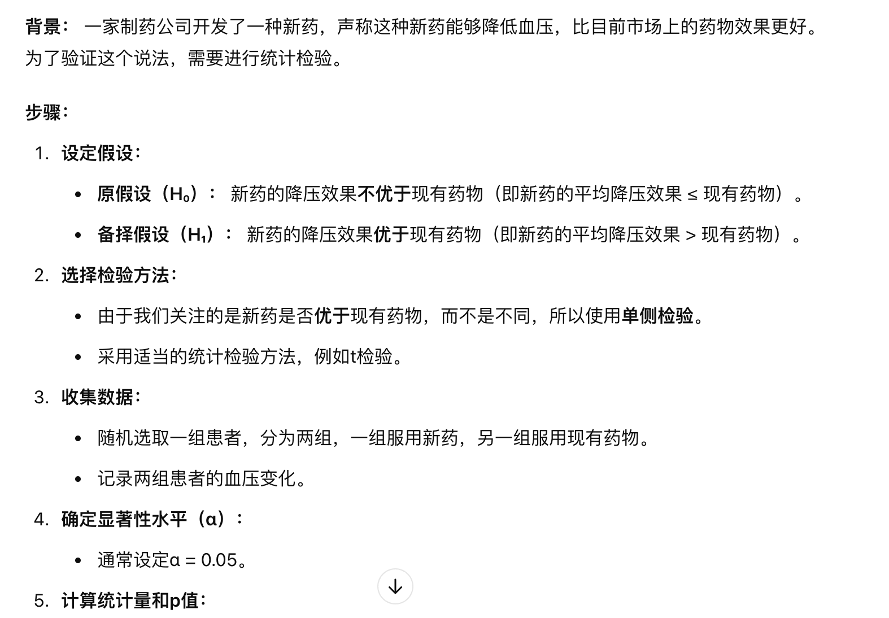

DBGT :
每次构建一颗新树，前面的所有树都保持不变，新树根据当前的残差进行拟合
损失函数最小化，梯度下降法最小化目标损失函数
弱学习器： 使用深度较浅的决策树作为弱学习器，以避免过拟合
灵活性，使用不同的损失函数，适应多种任务（中小型数据）
训练速度较慢 尤其在大数据集上

xgboost : 对dbgt 工程和算法上的优化 

不断添加树，学习新函数 拟合上次预测的残差（二阶泰勒展开）
（XGBoost使用了和CART回归树一样的想法，利用贪婪算法，遍历所有特征的所有特征划分点，不同的是使用的目标函数不一样。具体做法就是分裂后的目标函数值比单子叶子节点的目标函数的增益，同时为了限制树生长过深，还加了个阈值，只有当增益大于该阈值才进行分裂。从而继续分裂，形成一棵树，再形成一棵树，每次在上一次的预测基础上取最优进一步分裂/建树。）

工程优化： 数据按块分割，提高缓存命中率
并行计算：在构建树时 使用多线程并行计算 （层级树，会有浪费的情况，成本比较高）
分布式计算： 支持分布式计算

算法优化：增加了l1 和 l2正则化，有效防止过拟合
自动缺失值处理，不需要管
可以自定义损失函数
适合 数值特征

缺点： 学习成本，训练时间长

lightgbm： 离散化，用直方图来计算，同时用的树是深度树（叶子节点分裂策略），避免冗余
提高训练速度，内存效率 并行计算（中规模数据）
单边梯度采样 goss

Catboost:
类别特征处理，catboost 原生支持类别特征处理，不需要自己编码处理
对称树结构     有序提升方法 防止信息泄漏
gpu加速
小数据集 小于10000条 表现优异

# 金融风控
## 业务背景
### 信贷业务中的风险控制
- 本人欺诈  
    - 白户风险 ： 缺少征信数据 风险无法评估
    - 黑户风险 ： 历史逾期 失信 欺诈 黑名单用户
    - 恶意欺诈 ： 伪造个人信息 骗贷
    - 以贷养贷 ： 拆东墙补西墙，靠借贷维持资金链
- 他人欺诈
    - 伪冒身份 ： 伪冒他人身份进行欺诈骗贷

- 团伙欺诈
    - 中介/团伙欺诈 ： 黑中介组织团伙，欺诈骗贷

### 消费贷和现金贷的区别
- 消费贷有用途限制： 通常用于买车 家电， 直接支付给商家
- 现金贷款项直接存入借款人的银行账户，约束相对较弱，风险更大

### 风控相关术语介绍
- 账龄(Month on Book，MOB)
   - 指资产放款月份。申贷订单被放款，便有了账龄和生命周期。
   - MOB0：放款日至当月月底
   - MOB1：放款后第二个完整的月份
   - MOB2：放款后第三个完整的月份
*MOB的最大值取决于信贷产品期限。如果是12期产品，那么该资产的生命周期是12期，MOB最大到MOB12。*  

 - 逾期天数(Days Past Due，DPD)
    - 逾期天数 = 实际还款日 - 应还款日。
    - DPD N+表示逾期天数 >= N天，如DPD30+表逾期天数 >=30天的资产
    - 例如，若还款日是每月8号，那么9号就是逾期1天（DPD1）。如果客户在10号还款，那么逾期2天（DPD2）。

 - 逾期期数（M）
    - 指实际还款日与应还款日之间的逾期天数， 并按区间划分后的逾期状态。
    - M0：当前未逾期（或用C表示，取自Current）
    - M1：逾期1-30日
    - M2：逾期31-60日
    - M3：逾期61-90日
    - M4：逾期91-120日
    - M5：逾期121-150日
    - M6：逾期151-180日
    - M7：逾期180日以上。此时也被称为呆账（Bad Debts）

 - 风控相关术语介绍
 
    
### 信贷业务中的风险控制
- 风控业务主要针对两类风险： 信用评分系统 and 反欺诈系统

- 客群标签，模型分数，区分度较强的变量
- 模型： 充分利用多维度数据，结合机器学习算法来区分客群的好坏

### 信贷业务如何运行
- 市场部门 -》 获客： 存量激活/新客转化
    - 营销响应模型
- 风控部门 -》 筛选用户
    - 找到额度 利率的最佳平衡点

- 催收部门
    - 不同的客户分配不同的催收员
    - 失联模型

- 评分卡 A B C卡
    - 贷前 申请评分卡 application score card
    - 贷中 行为评分卡 behavior score card
    - 贷后 催收评分卡 collection score card  
*C卡因为用途不同Y的取值可能有区别，公司有内催，有外催。外催回款率低，单价贵，可以根据是否被内催催回来定义C卡的Y*

### 风控特征工程(通用)

### 样本不均衡问题/异常点检测

### 模型的可解释性-sharp

# 机器学习/数据挖掘 笔记
## 集成学习
### 随机森林算法 (bagging)
note: 通过组合多个弱分类器，最终结果通过投票或取均值，使得整体模型的结果具有较高的精确度和泛化性能，同时也有很好的稳定性，广泛应用在各种业务场景中。 

- 由于随机森林引入了**样本扰动**和**特征扰动**，从而很大程度上提高了模型的泛化能力，尽可能地避免了过拟合现象的出现。 样本扰动具体表现在作为bagging的集成算法，对于总体样本集T，抽样一个子集作为训练样本集，同时对于k个特征，每次仅选择d < k 个特征构建决策树。 达到了样本扰动和特征扰动的效果。
- 随机森林可以处理高维数据，无需进行**特征选择**，在训练过程中可以得出不同特征对模型的重要性程度。
- 随机森林的每个基分类器采用决策树，方法简单且容易实现。同时每个基分类器之间没有相互依赖关系，整个算法易并行化.  
**Note**:  
随机森林不需要对特征进行规范化，因为他是基于决策树的集成算法，决策树的工作原理并不依赖于特征值的尺度或范围。通过特征来分割规则，使用阈值来判断，并不是通过计算距离来判断，特征的绝对尺度对数的分裂点选择没有影响。树仅关心某个特质是否大于或小于特定的阈值。 对特征分布不敏感，决策树的构建过程是对每个特征进行独立分裂，只涉及特征值的排序和阈值的选择，不依赖于数据是否规范化，无论特征是否被缩放，树的分裂方法，最终结果不会收到影响。 
不像svm， knn 等基于距离或内积计算的模型，对特征尺度较为敏感

### Boosting
Boosting 是一种提升算法，可以将弱的学习算法提升 (boost) 为强的学习算法。基本思路如下：

1. 利用初始训练样本集训练得到一个基学习器。
2. 提高被基学习器误分的样本的权重，使得那些被错误分类的样本在下一轮训练中可以得到更大的关注，利用调整后的样本训练得到下一个基学习器。
3. 重复上述步骤，直至得到个学习器。
4. 对于分类问题，采用有权重的投票方式；对于回归问题，采用加权平均得到预测值。

### GBDT 梯度提升树 (回归问题，分类问题都可)
简单来说, 就是先对目标值求平均，然后算出每一组目标值的残差是多少，通过拟合残差的形式，$f_2(x) = f_1(x) + \alpha * T(x)$, 不断循环直到平方误差小于某一个阈值为止。这里的alpha是学习率(控制每棵树对整体模型的贡献)，通常取0.5，在[0,1]之间即可，T(x)为每一次的残差。(损失函数是最小均方误差)  
对于二分类问题，残差计算使用损失函数的梯度，结果输出使用sigmod函数，多分类问题使用softmax函数。<color font='red'>之所以使用梯度，因为负梯度就是残差的近似值</color> 使用的是目标分类的概率值，与预测概率之间的差值进行迭代  
  
课件:<embed src="/GBDT_cours.pdf" type="application/pdf" width="100%" height="600px" />

*以上资源来自网上共享，如有侵权请联系我删除*
  
  
提升树和gbdt的区别主要在哪里：
-  提升树的概念（Boosted Trees） 
提升树本质上是一种集成方法，它通过迭代训练一系列决策树，每一棵树都试图纠正前一棵树的错误。基本思想是将多个简单模型（弱学习器）组合在一起，最终获得一个强大的模型。 

Boosting 的概念早在 AdaBoost 算法中引入，后来的许多改进都基于这一思想。提升树（Boosted Trees）是 Boosting 和决策树结合的一个分支，它可以有多种实现方式。 

- GBDT 是梯度提升（Gradient Boosting）的特定实现  
GBDT 是提升树的一个具体实现，它使用梯度下降的思想来优化模型。GBDT 每一步都基于模型的残差（即当前模型与实际目标之间的差异），并通过拟合新的决策树来逐步减少这些残差。 

GBDT 的主要特点：
损失函数最小化：GBDT 在每一轮迭代中通过最小化损失函数来更新模型。损失函数可以是均方误差、对数损失函数（分类任务）等。
梯度下降优化：通过计算损失函数的梯度来决定下一棵树如何拟合当前的残差，逐步逼近目标。
用于回归和分类：GBDT 可以用于回归和分类任务，常用的损失函数包括均方误差（回归）和对数损失（分类）。

### XGBOOST算法
*课件*  
<embed src="/xgboost.pdf" type="application/pdf" width="100%" height="600px" />

*以上资源来自网上共享，如有侵权请联系我删除*
  
笔记:  
还得看 xgboost 数学推导公式 有点难，看不懂反复看别人的教程。

### 信息增益公式

对比lightgbm，xgboost， catboost 相同点 不同点 

## 数据预处理之特征工程

### 缺失值处理
- **删除缺失值**：直接删除包含缺失值的样本或特征。
- **填补缺失值**：使用均值、中位数、众数或其他算法（如K近邻）填补缺失的数据, 使用<strong>多重插补</strong>算法(应用小数据集 推测特征之间有一定关系)。

### 标准化与归一化
- **标准化（Standardization）**：将特征转换为均值为0，标准差为1的分布，常用于算法对尺度敏感的模型，如支持向量机（SVM，常见回归算法。
- **归一化（Normalization）**：将特征缩放到特定范围（如0到1），适用于神经网络等需要统一输入范围的模型。

### 编码分类变量
- **独热编码（One-Hot Encoding）**：将分类变量转换为二进制向量，适用于无序类别。
- **标签编码（Label Encoding）**：将分类变量转换为整数标签，适用于有序类别。
- **目标编码（Target Encoding）**：根据目标变量的统计信息对分类变量进行编码，适用于高基数类别。

### 特征选择
- **过滤方法（Filter Methods）**：根据统计指标（如相关系数、卡方检验）选择重要特征。
- **包装方法（Wrapper Methods）**：使用特定的机器学习算法评估特征子集的性能，如递归特征消除（RFE）。
- **嵌入方法（Embedded Methods）**：在模型训练过程中进行特征选择，如L1正则化。

### 特征提取
- **主成分分析（PCA）**：通过线性变换将高维特征降维，保留主要信息。
- **线性判别分析（LDA）**：用于分类任务，寻找能最大化类间差异的特征空间。
- **独立成分分析（ICA）**：提取统计上独立的特征，常用于信号处理。

### 多项式特征与交互特征
- **多项式特征（Polynomial Features）**：生成原始特征的多项式组合，增加模型的非线性表达能力。
- **交互特征（Interaction Features）**：创建两个或多个特征的组合，如相乘、相除，以捕捉特征之间的关系。

### 时间序列特征
- **日期/时间分解**：提取年、月、日、星期、小时等时间组件。
- **滞后特征**：使用过去的时间点数据作为当前的特征。
- **滚动统计量**：计算移动平均、移动标准差等统计量。

### 文本特征工程
- **词袋模型（Bag of Words）**：将文本转换为词频向量。
- **TF-IDF**：考虑词频和逆文档频率，增强重要词的权重。
- **词嵌入（Word Embeddings）**：如Word2Vec、GloVe，将词语转换为连续向量，捕捉语义信息。

### 分箱与离散化
- **分箱（Binning）**：将连续变量划分为多个区间，如等宽分箱、等频分箱。
- **离散化**：将连续变量转换为离散类别，减少噪声和异常值的影响。

### 特征缩放与变换
- **对数变换（Log Transformation）**：减少数据的偏态分布，适用于正偏分布的数据。
- **平方根变换（Square Root Transformation）**：缓解数据的异方差性。
- **Box-Cox变换**：一种参数化的变换方法，用于使数据更接近正态分布。

### 高级特征工程
- **特征组合（Feature Construction）**：根据业务知识或数据关系创建新的特征。
- **特征降噪（Feature Denoising）**：通过去除噪声或冗余信息提高特征质量。
- **特征重要性评估**：使用模型评估特征的重要性，如基于树模型的特征重要性评分。

### 其他方法
- **聚合特征（Aggregation Features）**：在分组数据中计算统计量，如均值、总和、计数。
- **地理特征处理**：如经纬度的距离计算、区域编码等。

### 过采样 smote算法
简单来说，就是对少样本类别进行复制和插值。具体流程如下  
对于每个少数类样本，计算其与所有其他少数类样本的欧氏距离。

- 选择该样本的若干个最近邻样本。

- 根据一个介于0和1之间的随机值，选择一个邻居样本，并基于这两个样本生成合成样本。

- 重复上述步骤，直到生成足够多的合成样本。 
对于这些新生成的样本，合并到原来数据集中形成新的平衡数据集，对模型训练评估，不过要注意的是，由于只是对少样本的复制
或插值，并没有反应真实情况，存在过拟合的情况。

## 统计检验
### 1.零假设(原假设)与备择假设

所谓原假设，就是在进行统计检验时预先设定的假设条件，一般是在实验前<strong>最保守，最容易推翻</strong>的假设，
而之后实验的意义就是证明原假设是错误的，若原假设成立，可知他的统计量服从某个概率分布，若计算值落入否定域，可知发生小概率事件，
拒绝原假设

原则： 
- 原假设是在一次试验中有绝对优势出现的事件，而备择假设在一次试验中不易发生(或几乎不可能发生)的事件。因此，在进行单侧检验时，最好把原假设取为预想结果的反面，即把希望证明的命题放在备择假设上。 简单来说，既然原假设大概率发生，若证明本次事件落入小概率范围，那么一定拒绝原假设，则成功证明备择假设是对的，即我们想证明的东西。

### 2.卡方检验与卡方分箱

### 3. WOE 转换