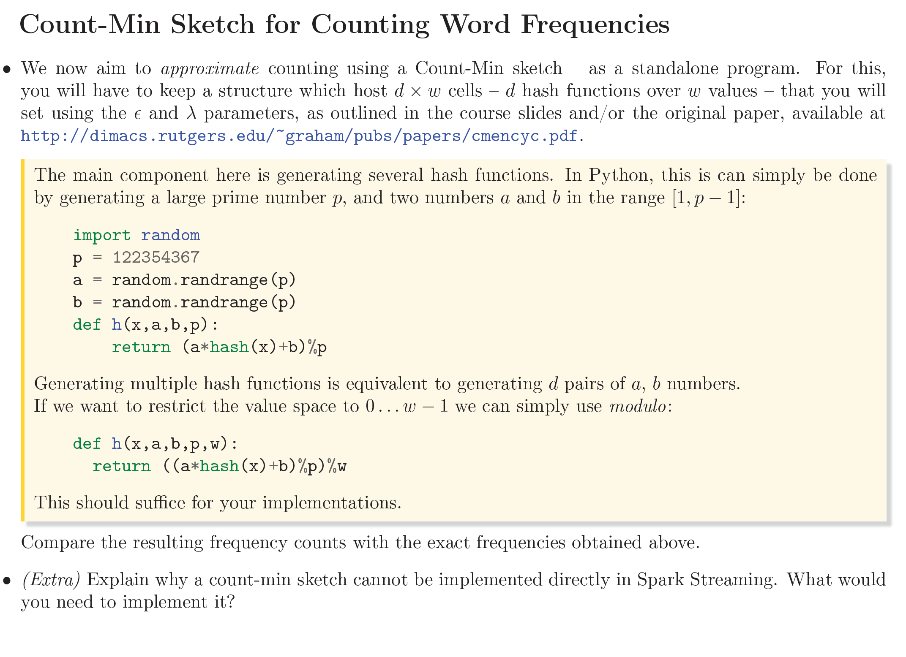
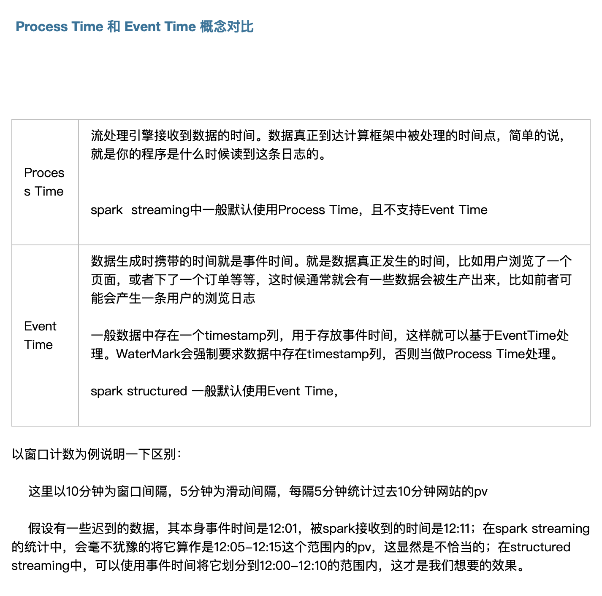

# 关于sparkContext 细节问题

当你在PySpark中使用`SparkSession.builder...getOrCreate()`方法创建一个`SparkSession`实例时，如果在当前JVM中已经存在一个`SparkContext`实例，`getOrCreate()`会返回一个与现有`SparkContext`关联的`SparkSession`，而不是基于提供的配置创建一个新的实例。这就是为什么你看到`sc.getConf().getAll()`显示的配置是之前的配置，而不是你尝试设置的新配置。

这种设计允许在一个JVM进程中共享单个`SparkContext`实例，因为SparkContext管理着Spark的各种资源，比如连接到集群管理器的连接。如果你想要应用新的配置，有两种方法可以尝试：

### 方法1: 停止现有的SparkContext，然后创建一个新的

如果你确定不再需要现有的`SparkContext`和`SparkSession`，你可以先停止它们，然后创建一个新的实例。请注意，这会中断与现有SparkContext关联的所有作业。

```python
# 停止现有的SparkSession和SparkContext
spark.stop()

# 创建一个新的SparkSession和SparkContext
spark = SparkSession.builder.appName("TD1_3").master('local').getOrCreate()
sc = spark.sparkContext

# 现在sc.getConf().getAll()应该会显示新的配置
print(sc.getConf().getAll())
```

### 方法2: 从一开始就确保使用正确的配置

在你的应用程序的早期阶段设置正确的配置，并确保整个应用程序使用的是同一个`SparkSession`和`SparkContext`实例。这要求对应用程序的初始化逻辑进行适当规划，以避免重复创建`SparkContext`。

### 注意事项

- 更改Spark配置并重新初始化`SparkContext`可能不是在生产环境中推荐的做法，因为这涉及到停止和重新启动上下文，可能会导致计算任务中断和资源管理复杂化。
- 在进行开发和测试时，确保理解当前环境中`SparkContext`的状态，适时地进行管理和配置更改可以帮助避免潜在的问题。

综上所述，当你遇到`sc.getConf().getAll()`显示的还是之前的配置时，你可以选择停止现有的SparkContext并基于新的配置重新创建，或者在应用程序开始时就确保使用了正确的配置。


##### ***reference：https://zhuanlan.zhihu.com/p/395431025***


# RDD and dataframe

Apache Spark中的DataFrame和RDD（弹性分布式数据集）是两种不同的数据抽象，它们之间存在着密切的关系，但也有各自的特点和优势。

### RDD

- **基础**：RDD是Spark的最底层数据抽象，表示一个不可变、分布式的数据集合，可以并行操作。RDD提供了一种高度灵活的数据处理方式，但使用RDD需要开发者手动优化。
- **特点**：RDD的操作主要是底层的转换（如`map`、`filter`）和行动（如`count`、`collect`）操作。RDD操作提供了细粒度的控制，但不总是最高效的，特别是对于复杂的数据处理任务。

### DataFrame

- **基础**：DataFrame在RDD之上提供了一个更高级别的抽象，它是一个以列形式组织的分布式数据集，类似于关系型数据库中的表。DataFrameAPI是在Spark SQL的基础上构建的，提供了丰富的数据操作功能，如选择、过滤、聚合等。
- **特点**：DataFrame提供了比RDD更高效的内置优化，如Catalyst查询优化器和Tungsten执行引擎。开发者可以以类SQL的方式进行数据操作，同时也可以享受到Spark的弹性分布式特性。

### 关系

- **构建**：DataFrame是建立在RDD之上的。事实上，你可以将DataFrame视为一个有schema信息的RDD，其行为记录（Row）而列对应于记录的字段。你可以通过`df.rdd`将DataFrame转换为RDD，反之亦然。
- **性能**：虽然DataFrame提供了更简洁的API和内置优化，但在某些情况下，直接使用RDD可能会更加灵活，尤其是在处理非结构化数据或需要进行复杂自定义转换时。

### 分区与块的关系

- **分区**：RDD和DataFrame的分区表示数据集的一个逻辑划分。Spark在执行任务时，会在每个分区上并行执行。
- **块（Block）**：指的是物理存储上的数据块，比如HDFS上的文件块。Spark尝试在处理数据时保持数据的本地性，这意味着Spark任务会尽量在数据所在的节点上执行。

分区的大小不一定等同于一个块的大小。分区大小由数据读取时的配置决定（例如，`textFile`、`parquet`文件读取时的分区数），而块的大小通常由底层存储系统决定（如HDFS）。在读取数据时，Spark会根据数据源的块大小来推断默认的分区数量，但开发者可以通过参数显式指定分区数量，来优化任务的并行度和性能。

总结来说，DataFrame提供了一种高级、优化的数据处理方式，适合结构化数据操作，而RDD提供了底层的数据处理能力，更适合精细的控制和非结构化数据处理。理解它们的关系和各自的优势可以帮助开发者更好地利用Spark进行数据处理和分析。


# 广播变量 累加变量

累加变量
Spark提供的Accumulator，主要用于多个节点对一个变量进行共享性的操作。正常情况下在Spark的任务中，由于一个算子可能会产生多个task并行执行，所以在这个算子内部执行的聚合计算都是局部的，想要实现多个task进行全局聚合计算，此时需要使用到Accumulator这个共享的累加变量。

Accumulator:对Executor只能修改但是不可读，只对Driver可读，在记录集群的状态，尤其是全局唯一的状态，至关重要。

作为一个分布式集群肯定需要一个全局唯一的一个东西（例如：redis）spark提供了一个全局唯一的一个累加器，它就可以唯一的保持一个全局状态。只有Driver可读，（因为我们是通过Driver控制整个集群的状态的）


注意：Accumulator只提供了累加的功能。在task只能对Accumulator进行累加操作，不能读取它的值。只有在Driver进程中才可以读取Accumulator的值。

广播一定是由Driver发给当前Application分配的所有的Executor内存级别的全局只读变量。Executor中的线程池中的线程共享该全局变量，极大的减少了网络传输（否则的话每个Task都要传输该变量）并极大的节省了内存，当然也隐形的提高了CPU的有效工作。


# 延迟计算（Lazy Evaluation）

Apache Spark 的延迟计算（Lazy Evaluation）机制确实有助于容错和系统的高效运行。延迟计算意味着系统在真正需要执行计算以生成结果之前，不会立即执行任何计算操作。这种方式允许Spark优化整个数据处理流程，但在容错方面的贡献主要体现在以下几个方面：

1. **容错的基础设施**：Spark通过RDD（弹性分布式数据集）提供了一个容错的内存计算框架。RDD的一个关键特性是它能够记住它是如何从其他数据集（例如文件、其他RDD等）计算出来的，这种记忆通过称为血缘（lineage）的概念实现。在发生部分节点失败时，Spark可以利用这种血缘信息重新计算丢失的数据分区，而不是重启整个作业。
2. **优化资源利用**：通过延迟计算，Spark能够更好地理解整个数据处理流程，从而进行更优的任务调度和资源分配。这不仅提高了系统的效率，还意味着在发生故障时，系统可能更快地恢复，因为它可以避免不必要的计算和数据传输。
3. **故障恢复**：在执行阶段，如果某个任务失败，Spark会尝试在其他节点上重新执行失败的任务。由于延迟计算允许Spark在执行之前拥有整个作业的全局视图，它可以更智能地进行这种重新调度，尽量减少因失败导致的性能开销。
4. **数据检查点**：虽然这不是延迟计算特有的，但与容错紧密相关。Spark允许用户对RDD设置检查点，即将RDD的当前状态保存到可靠的存储系统中。这在长数据处理管道中特别有用，因为它减少了在发生失败时需要重新计算的数据量。通过延迟计算，Spark可以在最佳的时间点自动或根据用户指示执行这些检查点。


不同stage之间 使用serialization 序列化传递

https://blog.csdn.net/czmacd/article/details/122886220?ops_request_misc=%257B%2522request%255Fid%2522%253A%2522171221621116777224469443%2522%252C%2522scm%2522%253A%252220140713.130102334.pc%255Fall.%2522%257D&request_id=171221621116777224469443&biz_id=0&utm_medium=distribute.pc_search_result.none-task-blog-2~all~first_rank_ecpm_v1~rank_v31_ecpm-2-122886220-null-null.142^v100^pc_search_result_base2&utm_term=spark%20不同stage之间%20序列化原理&spm=1018.2226.3001.4187


# Spark Streaming

### filestream

在文件从临时目录到指定监听目录中，文件如果要使用mv ，必须先使用touch 对文件进行更新，因为sparkstreaming 会检测文件的最后更新状态，如果更新时间不变 默认是不会进行文件处理的
为什么不能用cp 指令
1.因为sparkstreaming 监听的文件目录要求是原子性的，意味着在搬进该文件目录下之前 数据已经完整存在
2.cp 移动首先是创建 文件逐快写入，这样的操作不是原子性的
3.mv 则是修改文件目录索引 并不涉及物理数据上的移动 因此是原子性操作


### 批次写入问题

直接在`DStream`上调用`.saveAsTextFiles()`方法（例如，`counts.saveAsTextFiles(path, suffix)`）确实可以将数据保存到外部存储系统，但这种方法在处理和输出数据时有一些限制和考虑事项：

### 1. **自动目录创建**：
- `.saveAsTextFiles()`会为每个批次自动创建一个新目录（基于指定的`path`和时间戳），即使该批次的RDD为空（没有数据）。这可能导致大量空目录的创建，如果数据流经常出现空批次的话。

### 2. **文件命名和组织**：
- 该方法会按批次时间生成目录和文件名，这限制了对输出文件命名的控制。如果你需要基于内容或其他自定义逻辑命名文件，直接使用`.saveAsTextFiles()`可能不符合需求。

### 3. **处理空批次**：
- 如上所述，即使没有数据，也会为每个批次创建目录和文件。这可能不是你想要的行为，特别是在希望仅在有数据时才进行数据持久化的情况下。

### 4. **性能考虑**：
- 每个批次创建新文件和目录可能对文件系统的性能产生影响，特别是在高吞吐量的情况下。此外，大量小文件的创建和存储可能不利于后续的数据处理和分析。

### 5. **灵活性和控制**：
- 使用`.saveAsTextFiles()`意味着你放弃了对写入过程的精细控制，如错误处理、动态决定是否写入、管理数据库连接等。使用`foreachRDD`可以在每个批次级别上提供更细致的控制和灵活性。

### 解决方法和实践建议

如果你确实需要直接保存`DStream`数据，并且上述限制对你的应用不构成问题，使用`.saveAsTextFiles()`是一个简单有效的方法。然而，为了更细致地控制数据的输出，避免空目录的创建，或者在输出之前对数据进行额外的处理，建议使用`foreachRDD`方法。这样，你可以在每个批次级别上应用自定义的逻辑，例如：

```python
def saveRDD(rdd):
    if not rdd.isEmpty():
        # 这里可以添加更多的逻辑，比如动态生成路径，处理错误等
        rdd.saveAsTextFile("path/to/output-"+str(someTimestampFunction()))

counts.foreachRDD(saveRDD)
```

通过这种方式，你可以避免不必要的目录创建，优化文件组织，提高应用的整体效率和效果。


## 关于Count-min-sketch 算法 

*Explain why a count-min sketch cannot be implemented directly in Spark Streaming. What would*

*you need to implement it?*



这张图片是关于Count-Min Sketch数据结构的，主要用于估算单词频率。Count-Min Sketch是一种概率数据结构，用于处理大数据流的频率查询，其优点是能够在有限的内存中处理大量数据。

代码段中展示了如何在Python中生成hash函数，用于构建Count-Min Sketch的一部分。这个hash函数使用了一个大质数`p`，以及随机生成的`a`和`b`系数来调整输入值`x`的hash值。这些hash函数将用于Count-Min Sketch中的不同"桶"来计数。

第一个hash函数`h(x, a, b, p)`简单地将输入`x`的hash值乘以`a`加上`b`，然后取模`p`，以确保结果在合理范围内。第二个函数`h(x, a, b, p, w)`额外增加了一个模`w`的操作，这样就将值限制在了`0`到`w-1`的范围内，这对应于Count-Min Sketch中一行的宽度。

任务还要求比较这种近似计数方法与实际频率计数的结果，并解释为什么Count-Min Sketch不能直接在Spark Streaming中实现，以及如果要在Spark Streaming中实现它需要什么。

关于不能直接在Spark Streaming中实现Count-Min Sketch的原因，这可能是因为：

1. **Statelessness**: Spark Streaming操作通常是无状态的，但Count-Min Sketch需要维护状态（即，计数）。
2. **Distributed Nature**: Count-Min Sketch需要所有数据点对应的计数器被精确更新，而Spark Streaming是分布式的，这可能导致同步问题。
3. **Custom Operations**: Spark Streaming可能没有内置支持自定义数据结构和操作，如Count-Min Sketch所需的操作。

为了在Spark Streaming中实现Count-Min Sketch，你可能需要：

1. Stateful Operations**: 实现或利用Spark的状态化操作，例如mapWithState或updateStateByKey，来保持和更新Count-Min Sketch的状态。
2. **Custom Transformations**: 创建自定义转换来处理数据流，并更新Count-Min Sketch结构。
3. **Distributed Counters**: 设计机制以在Spark的分布式环境中同步计数器更新。

## spark streaming processing time and  event time 对比

**


## graphx 

PageRank 算法的应用：

1. **网页排名**：最初被用于 Google 搜索引擎来对搜索结果进行排序。
2. **社交网络**：分析用户的影响力或重要性。
3. **推荐系统**：推荐重要的物品或内容。
4. **生物信息学**：识别重要的基因或蛋白质网络中的节点。

您提供的代码段通过 Apache Spark 的 GraphX 执行了 PageRank 算法，并输出了每个顶点的 PageRank 值。这些值反映了每个节点在图中的相对重要性。以下是 PageRank 值的解释以及为什么它们会是这样：

### PageRank 的计算原理
PageRank 通过网络中节点的链接结构计算每个节点的重要性。一个节点的重要性取决于指向它的节点的数量（入度）和这些节点的重要性。算法通过迭代更新每个节点的 PageRank 值，直到达到收敛（即连续迭代之间的差异非常小，这里的阈值设为 0.0001）。

### 图的结构
您的图由六个顶点和八条边构成，边的权重在此例中未直接用于计算 PageRank，但在真实应用中，边的权重可以用来调整传递的 PageRank 值的比例。

### PageRank 值的解释
- **顶点 1** (Alice)：由 Bob 和 David 指向。虽然只有两条入边，但由于其中一个是高权重节点（Bob），它获得了相对较高的 PageRank 值。
- **顶点 2** (Bob)：被 Charlie 和 Ed 指向。Bob 被两个相对较低 PageRank 值的节点指向，但是由于网络中的结构和迭代传播，Bob 的 PageRank 值依然显著。
- **顶点 3** (Charlie)：只由 Ed 指向，因此其 PageRank 值较低。
- **顶点 4** (David)：被 Bob 指向，由于 Bob 的重要性，David 的 PageRank 也相对较高。
- **顶点 5** (Ed)：没有节点指向 Ed，因此其 PageRank 值最低。
- **顶点 6** (Fran)：由 Charlie 指向。虽然只有一个入边，但由于迭代的效果，其 PageRank 值与 Bob 相同。

### PageRank 值的计算细节
PageRank 值的具体数值是通过迭代计算获得的，起始时每个顶点的 PageRank 分配为 1/n （n 是顶点数），然后按照 PageRank 公式更新每个节点的值：
\[ PR(u) = \frac{1-d}{N} + d \sum_{v \in B_u} \frac{PR(v)}{L(v)} \]
其中：
- \( PR(u) \) 是顶点 u 的 PageRank 值。
- d 是阻尼因子（通常设置为 0.85），代表随机跳转的概率。
- \( N \) 是顶点总数。
- \( B_u \) 是指向 u 的所有顶点的集合。
- \( L(v) \) 是顶点 v 的出度。

### 总结
生成的 PageRank 值表明，虽然 Alice 和 Bob 并不是所有人都直接关注，但因为重要的人物指向他们，使得他们的重要性在网络中被提升。这反映了 PageRank 算法的核心思想：一个节点的重要性不仅取决于有多少节点指向它，还取决于指向它的这些节点的重要性。


### tp graph 最后一道题

val sourceId: VertexId = 1 // assuming 1 is the source vertex
val initialGraph = graph.mapVertices((id, _) => if (id == sourceId) 0.0 else Double.PositiveInfinity)

val sssp = initialGraph.pregel(Double.PositiveInfinity)(
  (id, dist, newDist) => math.min(dist, newDist), // Take the minimum distance
  triplet => {  // If the vertex distance is less than the vertex distance + edge attribute, send message
    if (triplet.srcAttr + triplet.attr < triplet.dstAttr) {
      Iterator((triplet.dstId, triplet.srcAttr + triplet.attr))
    } else {
      Iterator.empty
    }
  },
  (a, b) => math.min(a, b) // Get the minimum of two distances
)
sssp.vertices.collect().foreach(println)
