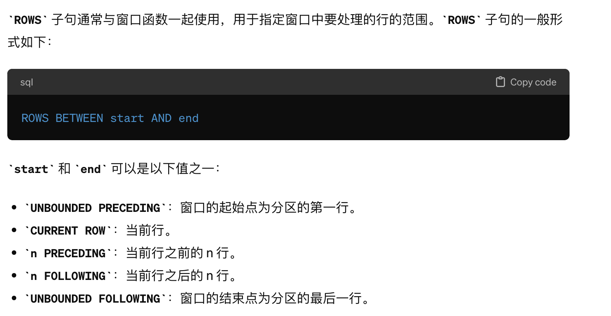

# 1.条件判断

空值判断 is null

Count()函数 

- 如果需要获取表的总行数（不考虑任何列值是否为NULL），应该使用`COUNT(*)`或`COUNT(1)`。
- 如果想要统计某列中非NULL值的数量，应该使用`COUNT(column_name)`。
- Count(里面传入任何值) count(1) count(0) 都是在计算行数 不关心里面具体的值，只计算非null值
- 在count 里面如果写case when。但是没有写else 默认情况是null, 
- 如果不用case when 直接写条件在count 里面，是没有任何作用的，因为它里面并不会返回null值

判断空函数 赋值 COALESCE(tmp2.attended_exams, 0)，如果该列非空 使用第一个值 若为空则使用第二值

if函数  IF(condition, value_if_true, value_if_false)

```sql
SELECT
    name,
    salary,
    IF(salary > 5000, 'High salary', 'Normal salary') AS salary_status
FROM employees;

```

case语句

```sql
CASE
    WHEN condition1 THEN result1
    WHEN condition2 THEN result2
    ...
    ELSE default_result
END

```

```sql
SELECT
    name,
    salary,
    CASE
        WHEN salary <= 3000 THEN 'Entry level'
        WHEN salary BETWEEN 3001 AND 7000 THEN 'Mid level'
        WHEN salary > 7000 THEN 'Senior level'
        ELSE 'Not specified'
    END AS salary_level
FROM employees;

```


# 2.常用函数

```
ABS(x)         --返回x的绝对值 
BIN(x)         --返回x的二进制（OCT返回八进制，HEX返回十六进制） 
CEILING(x)     --返回大于x的最小整数值 
EXP(x)         --返回值e（自然对数的底）的x次方 
FLOOR(x)       --返回小于x的最大整数值 
GREATEST(x1,x2,...,xn) 
                --返回集合中最大的值 
LEAST(x1,x2,...,xn)    
                --返回集合中最小的值 
LN(x)           --返回x的自然对数 
LOG(x,y)        --返回x的以y为底的对数 
MOD(x,y)        --返回x/y的模（余数） 
PI()            --返回pi的值（圆周率） 
RAND()          --返回０到１内的随机值,可以通过提供一个参数(种子)使RAND()随机数生成器生成一个指定的值。 
ROUND(x,y)      --返回参数x的四舍五入的有y位小数的值 
SIGN(x)         --返回代表数字x的符号的值 
SQRT(x)         --返回一个数的平方根 
TRUNCATE(x,y)   --返回数字x截短为y位小数的结果 
```

```
AVG(X)            --返回指定列的平均值 
COUNT(X)          --返回指定列中非NULL值的个数 
MIN(X)            --返回指定列的最小值 
MAX(X)            --返回指定列的最大值 
SUM(X)            --返回指定列的所有值之和 
GROUP_CONCAT(X)   --返回由属于一组的列值连接组合而成的结果，非常有用 
GROUP_CONCAT(name ORDER BY name ASC SEPARATOR ',')
列名 前同样可以加distinct
GROUP_CONCAT(distinct product ORDER BY product ASC SEPARATOR ',') as products
```

avg 等里面是可以写入其他if 函数的

```sql
字符串函数
ASCII(char)        --返回字符的ASCII码值 
BIT_LENGTH(str)    --返回字符串的比特长度 
CONCAT(s1,s2...,sn)  
                   --将s1,s2...,sn连接成字符串 
CONCAT_WS(sep,s1,s2...,sn) 
                   --将s1,s2...,sn连接成字符串，并用sep字符间隔 
INSERT(str,x,y,instr)  
                   --将字符串str从第x位置开始，y个字符长的子串替换为字符串instr，返回结果 
FIND_IN_SET(str,list) 
                   --分析逗号分隔的list列表，如果发现str，返回str在list中的位置 
LCASE(str)或LOWER(str)  
                   --返回将字符串str中所有字符改变为小写后的结果 
LEFT(str,x)        --返回字符串str中最左边的x个字符 
LENGTH(s)          --返回字符串str中的字符数 
LTRIM(str)         --从字符串str中切掉开头的空格 
POSITION(substr,str)  
                   --返回子串substr在字符串str中第一次出现的位置 
QUOTE(str)         --用反斜杠转义str中的单引号 
REPEAT(str,srchstr,rplcstr) 
                   --返回字符串str重复x次的结果 
REVERSE(str)       --返回颠倒字符串str的结果 
RIGHT(str,x)       --返回字符串str中最右边的x个字符 
RTRIM(str)         --返回字符串str尾部的空格 
STRCMP(s1,s2)      --比较字符串s1和s2 
TRIM(str)          --去除字符串首部和尾部的所有空格 
UCASE(str)或UPPER(str)  
                   --返回将字符串str中所有字符转变为大写后的结果
             
             
 substr (str,start,length) 返回子字符串， 默认start 开始到结尾
 upper 大写 lower 小写
 
 INSTR()
INSTR(str,substr)函数用于返回子串 substr 在字符串 str 中第一次出现的索引位置，没有找到子串时返回 0。
 
```

```
窗口函数
ROW_NUMBER() OVER()  --排序：1,2,3,4 
RANK() OVER() --排序：1,1,3,3,5 
DENSE_RANK() OVER()  --排序：1,1,2,2,3,4 
NTILE() OVER() --将有序数据分为N组，记录等级数 
LAG(expr,n) OVER() --返回当前行的前N行的expr的值 
LEAD(expr,n) OVER()  --返回当前行 后N行的expr的值 
```

```
控制流函数
CASE WHEN [test1] THEN [result1]...ELSE [default] END  
                    --如果test1是真，则返回result1，否则返回default 
CASE [test] WHEN [val1] THEN [result]...ELSE [default] END   
                    --如果test和valN相等，则返回result，否则返回default 
IF(test,t,f)        --如果test是真，返回t；否则返回f 
IFNULL(arg1,arg2)   --如果arg1不是空，返回arg1，否则返回arg2 
NULLIF(arg1,arg2)   --如果arg1=arg2返回NULL；否则返回arg1 
 
这些函数的第一个是IFNULL()，它有两个参数，并且对第一个参数进行判断。 
如果第一个参数不是NULL，函数就会向调用者返回第一个参数； 
如果是NULL,将返回第二个参数。 
例如 
SELECT IFNULL(1,2),  
IFNULL(NULL,10), 
IFNULL(4*NULL,'false'); 
 
NULLIF()函数将会检验提供的两个参数是否相等，如果相等，则返回NULL， 
如果不相等，就返回第一个参数。 
例如 
SELECT  NULLIF(1,1), 
 NULLIF('A','B'), 
 NULLIF(2+3,4+1); 
 
MySQL的IF()函数也可以建立一个简单的条件测试， 
这个函数有三个参数，第一个是要被判断的表达式， 
如果表达式为真，IF()将会返回第二个参数， 
如果为假，IF()将会返回第三个参数。 
例如 
SELECT IF(1<10,2,3),IF(56>100,'true','false'); 
IF()函数在只有两种可能结果时才适合使用。 
然而，在现实世界中，我们可能发现在条件测试中会需要多个分支。 
在这种情况下，它和PHP及Perl语言的switch-case条件例程一样。 
 
CASE函数的格式有些复杂，通常如下所示： 
CASE [expression to be evaluated] 
WHEN [val 1] THEN [result 1] 
WHEN [val 2] THEN [result 2] 
WHEN [val 3] THEN [result 3] 
...... 
WHEN [val n] THEN [result n] 
ELSE [default result] 
END 
这里，第一个参数是要被判断的值或表达式，接下来的是一系列的WHEN-THEN块， 
每一块的第一个参数指定要比较的值，如果为真，就返回结果。 
所有的WHEN-THEN块将以ELSE块结束，当END结束了所有外部的CASE块时， 
如果前面的每一个块都不匹配就会返回ELSE块指定的默认结果。 
如果没有指定ELSE块，而且所有的WHEN-THEN比较都不是真，MySQL将会返回NULL。 
CASE函数还有另外一种句法，有时使用起来非常方便，如下： 
CASE 
WHEN [conditional test 1] THEN [result 1] 
WHEN [conditional test 2] THEN [result 2] 
ELSE [default result] 
END 
这种条件下，返回的结果取决于相应的条件测试是否为真。 
例如： 
SELECT  CASE 'green' 
      WHEN 'red' THEN 'stop' 
      WHEN 'green' THEN 'go' END; 
 
SELECT CASE  9  
WHEN 1 THEN 'a' 
WHEN 2 THEN 'b' ELSE 'N/A' END; 
 
SELECT CASE WHEN (2+2)=4 THEN 'OK'  
WHEN (2+2)<>4 THEN 'not OK' END AS STATUS; 
 
SELECT Name,IF((IsActive = 1),'已激活','未激活') AS RESULT  
FROM UserLoginInfo; 
 
SELECT fname,lname,(math+sci+lit) AS total, 
CASE WHEN (math+sci+lit) < 50 THEN 'D' 
     WHEN (math+sci+lit) BETWEEN 50 AND 150 THEN 'C' 
     WHEN (math+sci+lit) BETWEEN 151 AND 250 THEN 'B' 
ELSE 'A' END AS grade FROM marks ; 
 
SELECT IF(ENCRYPT('sue','ts')=upass,'allow','deny') AS LoginResult 
FROM users WHERE uname = 'sue'; 

```

```
加密函数
AES_ENCRYPT(str,key)   
                   --返回用密钥key对字符串str利用高级加密标准算法加密后的结果，调用AES_ENCRYPT的结果是一个二进制字符串，以BLOB类型存储 
AES_DECRYPT(str,key)   
                   --返回用密钥key对字符串str利用高级加密标准算法解密后的结果 
DECODE(str,key)    --使用key作为密钥解密加密字符串str 
ENCRYPT(str,salt)  --使用UNIXcrypt()函数，用关键词salt(一个可以惟一确定口令的字符串，就像钥匙一样)加密字符串str 
ENCODE(str,key)    --使用key作为密钥加密字符串str，调用ENCODE()的结果是一个二进制字符串，它以BLOB类型存储 
MD5()              --计算字符串str的MD5校验和 
PASSWORD(str)      --返回字符串str的加密版本，这个加密过程是不可逆转的，和UNIX密码加密过程使用不同的算法。 
SHA()              --计算字符串str的安全散列算法(SHA)校验和 
 
例如 
SELECT ENCRYPT('root','salt') ; 
SELECT ENCODE('xufeng','key') ; 
SELECT DECODE(ENCODE('xufeng','key'),'key') ;--加解密放在一起 
SELECT AES_ENCRYPT('root','key') ; 
SELECT AES_DECRYPT(AES_ENCRYPT('root','key'),'key') ; 
SELECT MD5('123456') ; 
SELECT SHA('123456') ; 
```

```
时间函数
CURDATE()或CURRENT_DATE()  
                   --返回当前的日期 
CURTIME()或CURRENT_TIME()  
                   --返回当前的时间 
DATE_ADD(date,INTERVAL int keyword) 
                   --返回日期date加上间隔时间int的结果(int必须按照关键字进行格式化) 
例如 
SELECT DATE_ADD(CURRENT_DATE,INTERVAL 6 MONTH); 
 
DATE_FORMAT(date,fmt)   
                   --依照指定的fmt格式格式化日期date值 
DATE_SUB(date,INTERVAL int keyword) 
                   --返回日期date减去间隔时间int的结果(int必须按照关键字进行格式化) 
例如 
SELECT DATE_SUB(CURRENT_DATE,INTERVAL 6 MONTH); 
 
DAYOFWEEK(date)    --返回date所代表的一星期中的第几天(1~7) 
DAYOFMONTH(date)   --返回date是一个月的第几天(1~31) 
DAYOFYEAR(date)    --返回date是一年的第几天(1~366) 
DAYNAME(date)      --返回date的星期名，如：SELECT DAYNAME(CURRENT_DATE); 
FROM_UNIXTIME(ts,fmt)   
                   --根据指定的fmt格式，格式化UNIX时间戳ts 
HOUR(time)         --返回time的小时值(0~23) 
MINUTE(time)       --返回time的分钟值(0~59) 
MONTH(date)        --返回date的月份值(1~12) 
MONTHNAME(date)    --返回date的月份名，如：SELECT MONTHNAME(CURRENT_DATE); 
NOW()              --返回当前的日期和时间 
QUARTER(date)      --返回date在一年中的季度(1~4) 
例如 
SELECT QUARTER(CURRENT_DATE); 
 
WEEK(date)         --返回日期date为一年中第几周(0~53) 
YEAR(date)         --返回日期date的年份(1000~9999) 
例如，获取当前系统时间 
SELECT FROM_UNIXTIME(UNIX_TIMESTAMP()); 
SELECT EXTRACT(YEAR_MONTH FROM CURRENT_DATE); 
SELECT EXTRACT(DAY_SECOND FROM CURRENT_DATE); 
SELECT EXTRACT(HOUR_MINUTE FROM CURRENT_DATE); 
 
返回两个日期值之间的差值(月数) 
SELECT PERIOD_DIFF(200302,199802); 
 
在Mysql中计算年龄： 
SELECT DATE_FORMAT(FROM_DAYS(TO_DAYS(NOW())-TO_DAYS(birthday)),'%Y')+0 AS age FROM employee; 
这样，如果Brithday是未来的年月日的话，计算结果为0。 
下面的SQL语句计算员工的绝对年龄，即当Birthday是未来的日期时，将得到负值。 
SELECT DATE_FORMAT(NOW(), '%Y')  
- DATE_FORMAT(birthday, '%Y')  
-(DATE_FORMAT(NOW(), '00-%m-%d')  
< DATE_FORMAT(birthday, '00-%m-%d')) AS age from employee 
```

# 2. 注意事项

## 2.1 group by 可以识别select 重命名的列

```sql
select
date_format(trans_date,"%Y-%m") month,
country,
count(state) trans_count,
count(case when !strcmp(state,"approved") then 1 end) approved_count,
sum(amount) trans_total_amount,
sum(case when !strcmp(state,"approved") then amount else 0 end) approved_total_amount
from transactions
group by month,country;
```

在 SQL 查询中，`GROUP BY` 子句的确是在 `SELECT` 语句之前处理的，但这里的“之前”是指逻辑上的处理顺序，而非物理执行顺序。数据库优化器会解析整个查询，然后决定最有效的执行顺序。对于 `GROUP BY` 来说，尽管它逻辑上需要在选出特定列以计算聚合函数之前执行，但是实际上数据库能够识别出 `SELECT` 语句中定义的别名，并在分组操作中适当地使用这些别名。

简单来说，在执行查询时，数据库首先解析 `FROM` 子句确定要查询的表，然后根据 `WHERE` 子句过滤行，接着处理 `GROUP BY` 子句进行分组，然后执行 `SELECT` 语句中的列选择和计算，最后根据 `ORDER BY` 子句排序结果（如果有的话）。尽管 `SELECT` 列表在查询的末尾被指定，数据库在执行计划的早期阶段就会考虑到这些列，包括任何列的别名。

在你的例子中，`month` 是 `trans_date` 格式化后的别名，这个别名在 `GROUP BY` 子句中被使用。尽管逻辑上分组操作发生在选择列之前，但数据库知道 `month` 别名代表的是 `date_format(trans_date,"%Y-%m")` 的结果，因此能够正确地根据该表达式的结果进行分组。

这种能力归功于 SQL 解析器和优化器的智能，它们可以解析整个查询，理解列别名的含义，并在处理查询的不同阶段适当地应用这些别名。这就是为什么你可以在 `GROUP BY` 子句中使用 `SELECT` 列表中定义的别名，而不会引起错误。

## 2.2

Union and union all, union 去重，union all 不去重，性能更好

## 2.3 where 正则表达式写法

regexp ‘正则表达式’  
\\b 正则表达式 `\bword` 可以匹配以 "word" 开头的字符串，包括在 "word" 前面有空格的情况。因此，在字符串 "hello word1" 中，`\bword` 可以匹配到 "word1" 前面的单词 "word"，即使它前面有空格。

like %a 以a结尾，a% 以a开头 

邮箱验证

```sql
# Write your MySQL query statement below
select
    user_id,name,mail
from 
    users
where
    mail regexp '^[a-zA-Z][\\w\\./-]*@leetcode\\.com$'
```


## 2.4 窗口函数 row规则



## sql 单引号 双引号区别


## 获得第2高薪水，若没有返回null 的sql 题目

```sql
select ifNull(
(select distinct salary
from Employee 
order by Salary Desc
limit 1 offset 1),null
) as SecondHighestSalary;
```

这里对于只有一条数据的查询来说，无法从from 表获取数据，因为压根没有这条数据 不会形式数据表，所以直接在列名里进行操作

## order by 也可以使用聚合函数

```sql
select distinct customer_number
from Orders
group by customer_number
order by count(*) desc
limit 1;
```

## sum()聚合函数内部嵌入 case when 写法

```sql
select sale_date,
    sum(   
            (case when fruit='apples' then sold_num
                else -sold_num
                end
            )
    )as diff
from Sales
group by sale_date
```

## having 内部要记得 也可以使用聚合函数 and 之类的用法


顺序 from where groupby having select orderby limit 逻辑顺序

但是数据库一些优化手段 允许它可以在物理顺序上有些许不同 比如我在select 重命名 我们可以在group by 直接调用他的重命名名字

## where 内部查询 可以以（列名1，列名2）元组形式 in 子查询

## 窗口函数 排序函数rank() 里面over（） 的orderby 同样可以使用聚合函数！！！

```sql
select customer_id, product_id,
    rank() over(partition by customer_id order by count(product_id) desc) rnk
    from Orders 
    group by customer_id, product_id
```


## lead lag 函数中三个参数的意义

LEAD(expression [, offset [, default]]) OVER (partition_by_clause order_by_clause)，如果为空 则放入第三个参数

```sql
lead(visit_date,1,'2021-1-1') 第二个参数向后偏移量为1，若没有则为第三个参数
```

## CTE 公共表达式 之 recursive 用法

MySQL 中的递归查询通常用于处理层级或树形结构的数据，例如组织结构、分类目录等。自 MySQL 8.0 版本起，引入了公共表表达式（Common Table Expressions, CTEs），包括递归 CTEs，这使得构建递归查询变得简单许多。

### 递归 CTEs 的基本语法

递归公共表表达式（CTE）包含两部分：基础部分（非递归部分）和递归部分，它们通过 UNION 或 UNION ALL 连接。基础部分是递归操作的起点，而递归部分则引用了 CTE 自身，实现递归逻辑。

```sql
WITH RECURSIVE cte_name AS (
  -- 基础查询，起点
  SELECT ...
  UNION ALL
  -- 递归查询，引用自身
  SELECT ... FROM cte_name WHERE ...
)
SELECT * FROM cte_name;
```

### 示例：员工和经理的层级关系

假设有一个员工表 `employees`，其中包括 `employee_id`、`name` 和 `manager_id` 字段，`manager_id` 是该员工直接上级的 `employee_id`。以下查询可以展示从特定员工到最高级经理的路径。

```sql
WITH RECURSIVE employee_path AS (
  -- 基础查询：选择特定员工作为起点
  SELECT employee_id, name, manager_id
  FROM employees
  WHERE name = 'John Doe' -- 起点员工
  UNION ALL
  -- 递归查询：通过 manager_id 连接到 employee_id
  SELECT e.employee_id, e.name, e.manager_id
  FROM employees e
  INNER JOIN employee_path ep ON e.employee_id = ep.manager_id
)
SELECT * FROM employee_path;

```

这个查询开始于名为 "John Doe" 的员工，并通过不断地查找每个人的上级，构建出一个到达顶层管理者的路径。

### 注意事项

1. **递归深度**：MySQL 有一个默认的递归执行限制，为防止无限递归造成问题。如果你的查询超过这个限制，会得到错误信息。你可以通过设置系统变量 `max_execution_time` 来调整这个限制。
   
2. **性能问题**：递归查询可能会非常消耗资源，尤其是在处理大数据集时。应该小心使用，并尽可能优化查询条件。

3. **使用 UNION ALL vs. UNION**：通常建议使用 `UNION ALL` 而不是 `UNION`，因为 `UNION` 会对结果进行去重，这在大多数递归查询场景中是不必要的，且会增加额外的性能开销。

递归查询是一个强大的工具，可以帮助你解决许多复杂的数据问题，但也需要仔细和谨慎地使用。

`

```sql
with recursive t(task_id, subtask_id) as (
    SELECT task_id, subtasks_count FROM Tasks
    UNION ALL
    SELECT task_id, subtask_id-1 FROM t where subtask_id-1>0
)

SELECT * FROM t left join Executed using(task_id, subtask_id) 
WHERE Executed.subtask_id is null 
ORDER BY task_id, subtask_id

作者：蛋饼
链接：https://leetcode.cn/problems/find-the-subtasks-that-did-not-execute/solutions/705273/1767-jian-ji-xie-fa-recursive-xian-zhao-wl15z/
来源：力扣（LeetCode）
著作权归作者所有。商业转载请联系作者获得授权，非商业转载请注明出处。
```

`