# llm之prompt教程
<embed src="/openai_prompt.pdf" type="application/pdf" width="120%" height="1000px" />

*以上资源来自网上共享，如有侵权请联系我删除*
  

# 12.18 重新记录一下几种常见的机器学习和深度学习中梯度下降的方法
d = direction = -grad 

## 梯度下降算法
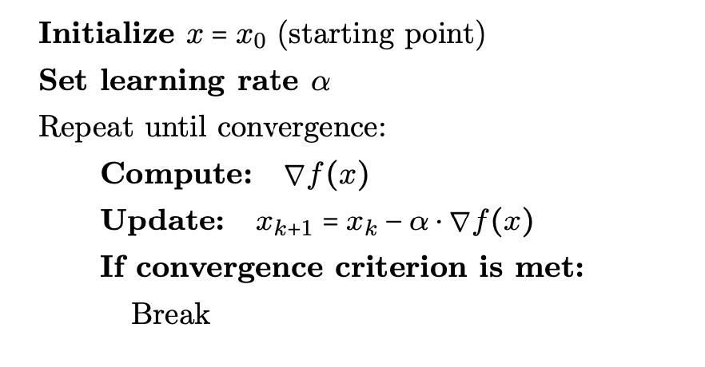
## 随机梯度下降算法
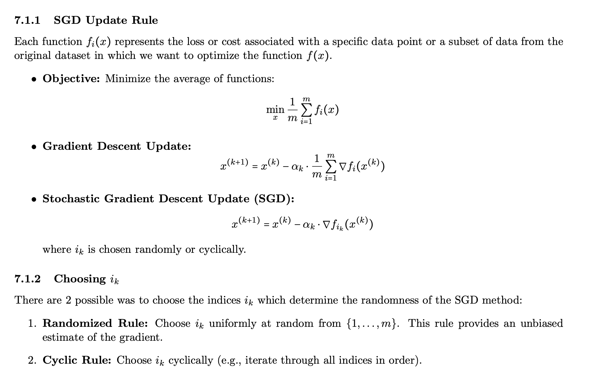
## 批量梯度下降算法
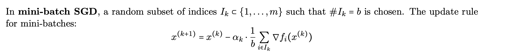
## armijo's rule
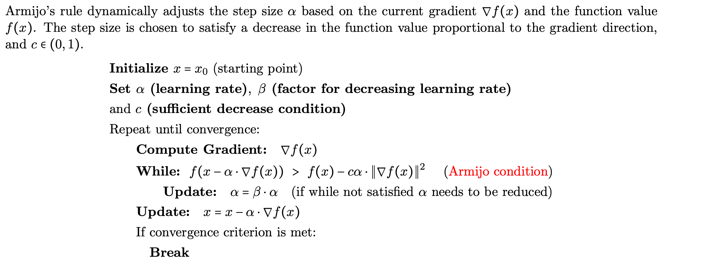
## 经典动量法
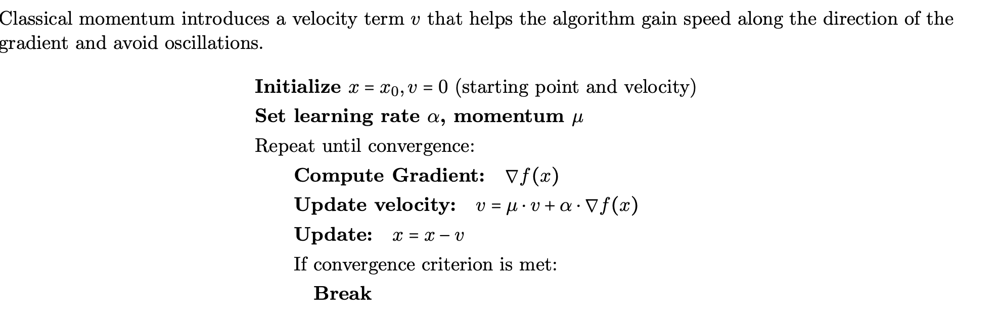
## 加速版动量法
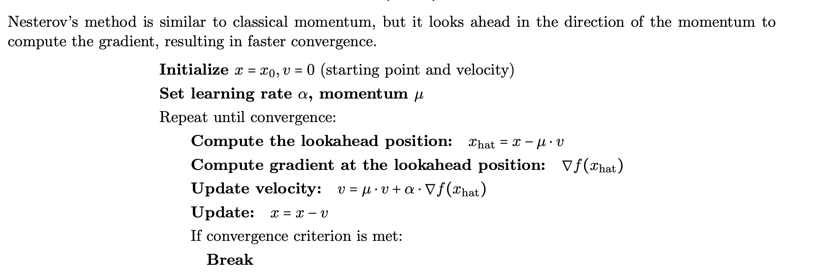
## secant法则（一种不需要计算导数，近似估计方法，是一种在newton法和无需导数的简单迭代法（二分法）的折中算法）
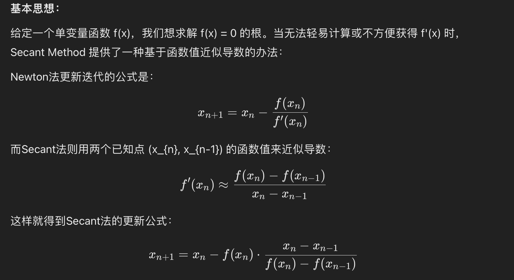
## 牛顿法
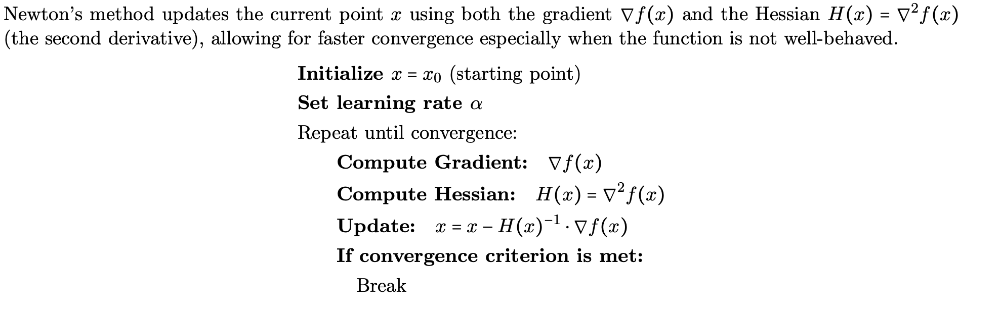
## 拟牛顿法（bfgs方法）
hessian矩阵在复杂的算法中比较难计算，所以使用一个矩阵代替该hessian矩阵
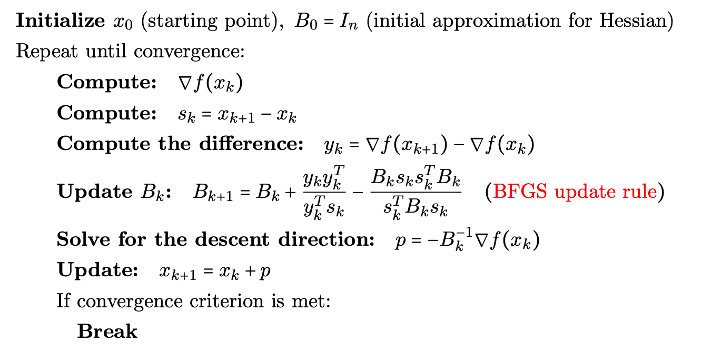

------------------------------------------------
*上述是传统梯度下降法以及各优化算法，但是对于复杂模型来说调参太难，同时参数空间各维度的尺寸差异导致收敛不均匀，有的方向下降快，有的方向下降慢*
下面介绍一些深度学习中常用的高级优化方法
## adagrad 算法
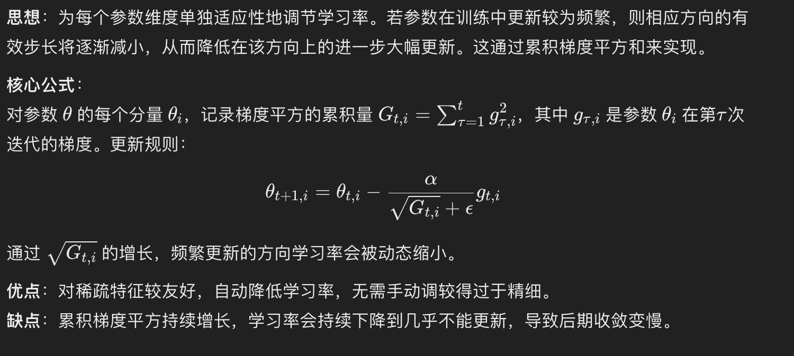
## adadelta 算法
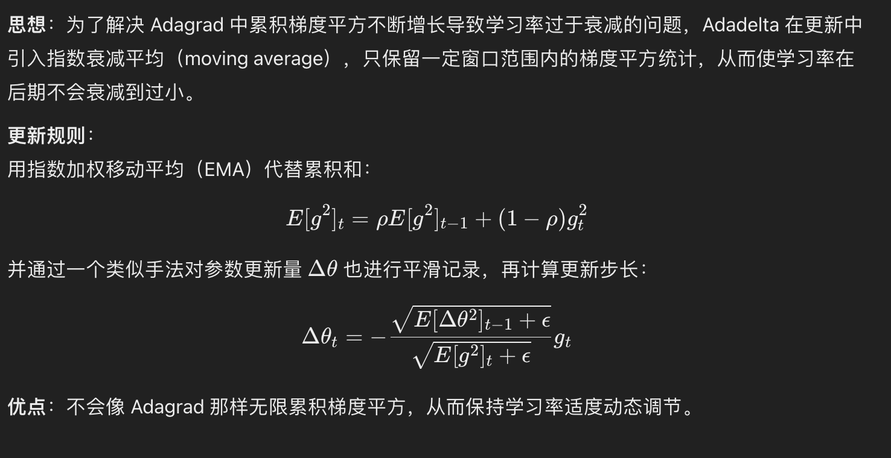
## rmsprop 算法
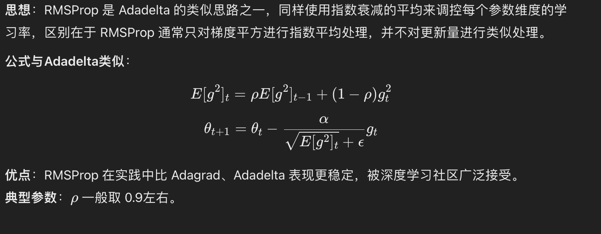
## adam 算法
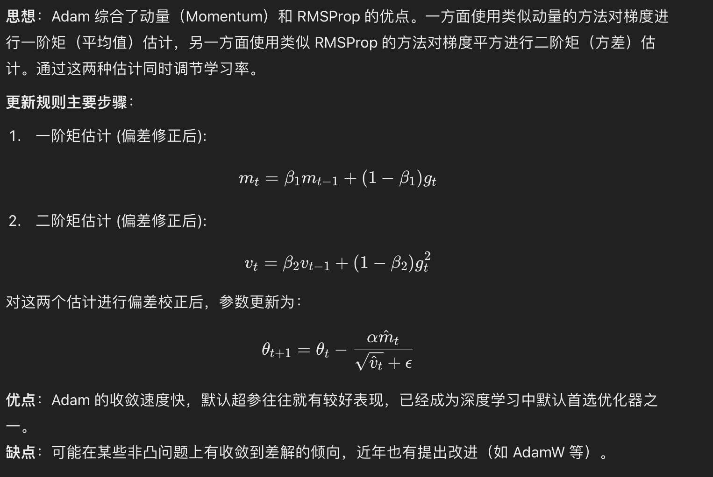
## adamw 算法
思想：AdamW 在 Adam 的基础上修正了 L2 正则化（权重衰减）的处理方式。传统 Adam 对权重衰减的实现并不严格等价于标准的权重衰减（因为在梯度和动量更新混合中出现了偏差），AdamW 将权重衰减从梯度更新步骤中独立出来，达到更正宗的正则化效果。

优点：AdamW 在处理 L2 正则方面更正确，使模型泛化更好，被认为是 Adam 在实际训练中的改进版本。

<strong>In summarize，其实不难发现这几个高级优化算法都有一个通用的特征是使用了梯度的二阶矩
为什么使用二阶矩？ 我个人认为它是作为方差或二阶矩信息的近似，
在随机梯度下降的情境下，每次计算的梯度本质上是对真实梯度的一个有噪声的估计。
梯度平方为我们提供了与“方差”有关的信息（即第二矩），可以看作对参数更新不确定性的衡量。
通过积累梯度的平方值（或其指数加权平均），我们在一定程度上就获得了该方向梯度分布的统计特性，从而以此动态调整更新步长，使得优化过程更加鲁棒。 同时对于自适应学习率的依据，使用梯度的平方来衡量参数维度上的更新幅度，可以动态调整该参数方向上的学习率。 若某个参数方向上的梯度一直较大，梯度的二阶矩其实是有放大作用，从而使该方向的学习率自动减小，避免参数在该方向上大幅震荡或发散。
若某个参数方向上的梯度始终较小，则梯度方向的累积也不会过快增加，这个方向上的学习率相对就会保持相对较大，有利于平缓的维度上进行更快的探索</strong>

# 11.05 深度学习 复习笔记
- 权重初始化
  - 常见权重初始化 Xavier, He initilisation, 依赖于神经元的输入和输出数量
  - 防止梯度消失和梯度爆炸：如果权重值过大或过小，会导致在反向传播过程中梯度逐层累积或消失，影响模型的训练。因此，通过合理的权重初始化，可以确保每层的梯度在合适的范围内，有助于稳定训练过程。 
  - 加速模型收敛：合理初始化权重可以使得模型在训练之初快速找到损失函数的收敛路径，从而减少训练所需的时间和计算资源。
  - 提高模型性能：好的初始权重可以使模型更容易找到全局最优解，避免陷入局部最优，从而提升模型的最终预测效果

- 梯度下降方案
  - 动量梯度：动量梯度下降是一种优化算法，改进了标准梯度下降算法，旨在提高训练神经网络时的收敛速度和稳定性。其核心思想是结合当前梯度和之前梯度的加权平均来更新参数，这样可以在避免震荡的同时，加快收敛速度。

具体公式如下： 1）计算当前梯度：$g_t = \nabla L(\theta_t)$  
2）更新速度项：$v_t = \beta v_{t-1} + (1 - \beta) g_t$，其中 $(\beta)$ 是动量因子（通常取值在0.9左右）    
3）更新参数：$[\theta_{t+1} = \theta_t - \alpha v_t]$，其中 $(\alpha)$ 是学习率。

通过引入动量，算法在梯度变化较小的方向上累积动量，从而加快参数更新，而在震荡较大的方向上减小更新幅度，从而更稳定地收敛到最优解。 
  - Adam优化器：结合了动量方法和RMSProp，动态调整学习率

#  🍺 深度学习调参技巧 9.26 ....🍺

- 不管什么模型，先在一个较小的训练集上train和test，看看它能不能过拟合。如果不能过拟合，可能是学习率太大，或者代码写错了  
- 先调小学习率试一下，如果还不行就去检查代码，先看dataloader输出的数据对不对，再看模型每一步的size是否符合自己期待。 
- 看train/eval的loss曲线，正常的情况应该是train loss呈log状一直下降最后趋于稳定，eval loss开始时一直下降到某一个epoch之后开始趋于稳定或开始上升，这时- 候可以用early stopping保存eval loss最低的那个模型。 
- 如果loss曲线非常不正常，很有可能是数据处理出了问题，比如label对应错了，回去检查代码。不要一开始就用大数据集，先在一个大概2w训练集，2k测试集的小数据集上调- 参。尽量不要自己从头搭架子（新手和半新手）。找一个已经明确没有bug能跑通的其它任务的架子，在它的基础上修改。否则debug过程非常艰难，因为有时候是版本迭代产生- 的问题，修改起来很麻烦。优化器优先用adam，学习率设1e-3或1e-4，再试Radam（LiyuanLucasLiu/RAdam）。 
- 不推荐sgdm，因为很慢。lrscheduler用torch.optim.lr_scheduler.CosineAnnealingLR，T_max设32或64，几个任务上试效果都不错。 
- （用这个lr_scheduler加上adam系的optimizer基本就不用怎么调学习率了）有一些任务（尤其是有RNN的）要做梯度裁剪，torch.nn.utils.clip_grad_norm。参数- 初始化，lstm的h用orthogonal，其它用he或xavier。激活函数用relu一般就够了，也可以试试leaky relu。batchnorm和dropout可以试，放的位置很重要。
- 优先尝试放在最后输出层之前，以及embedding层之后。
- RNN可以试layer_norm。有些任务上加了这些层可能会有负作用。
- metric learning中先试标label的分类方法。然后可以用triplet loss，margin这个参数的设置很重要。
- batchsize设置小一点通常会有一些提升，某些任务batchsize设成1有奇效。embedding层的embedsize可以小一些（64 or 128），之后LSTM或CNN的hiddensize要稍- 微大一些（256 or 512）。
（ALBERT论文里面大概也是这个意思）模型方面，可以先用2或3层LSTM试一下，通常效果都不错。 
- weight decay可以试一下，我一般用1e-4。有CNN的地方就用shortcut。
- CNN层数加到某一个值之后对结果影响就不大了，这个值作为参数可以调一下。
- GRU和LSTM在大部分任务上效果差不多。 
- 看论文时候不要全信，能复现的尽量复现一下，许多论文都会做低baseline，但实际使用时很多baseline效果很不错。 
- 对于大多数任务，数据比模型重要。面对新任务时先分析数据，再根据数据设计模型，并决定各个参数。例如nlp有些任务中的padding长度，通常需要达到数据集的90%以上，- 可用pandas的describe函数进行分析。